# Anirvium AI

Trajectory Intelligence for Enterprise Support Agents.

Anirvium AI is not a customer support chatbot. It is an observability, evaluation, diagnosis, and optimization layer for multimodal AI support-agent workflows. It shows why an agent made a decision, which text or visual evidence it used, where policy risk appears, whether escalation is needed, and how the workflow should improve.

The demo uses synthetic enterprise support data only.

## 60-Second Judge Summary

Anirvium AI is a trajectory intelligence platform for enterprise support agents. It captures each agent step, links decisions to evidence and policy, scores trajectory quality, diagnoses failures, and recommends concrete workflow improvements. The demo uses synthetic enterprise SaaS support tickets covering SLA risk, refunds, security/data deletion, customer churn risk, and escalation decisions.

What to inspect first:

1. [JUDGES_READ_THIS_FIRST.md](JUDGES_READ_THIS_FIRST.md)
2. `GET /demo/winning-run`
3. The dashboard button: `Load Winning Demo`
4. [architecture_diagram.md](architecture_diagram.md)
5. [amd/README_AMD_USAGE.md](amd/README_AMD_USAGE.md)

Winning demo path:

```bash
cd backend
uv run uvicorn app.main:app --port 8000
curl http://localhost:8000/demo/winning-run
```

Then start the frontend and click `Load Winning Demo`.

Current AMD status: real AMD GPU execution is pending. The vLLM/ROCm scripts, benchmark runner, and evidence paths are prepared. Sample benchmark files are marked as sample and are not claimed as verified AMD execution.

Do not use real customer data. No secrets are committed; use `.env.example` only.

## Why This Matters

Enterprises are deploying AI support agents faster than they can inspect them. When an agent mishandles a refund, misses an SLA, hallucinates evidence, or promises a security action without approval, support leaders need more than a transcript. They need a trajectory: steps, evidence, risk flags, approval states, scores, and concrete fixes.

Anirvium AI turns agent behavior into measurable infrastructure.

## Architecture

See [repo-structure.txt](repo-structure.txt) for the repository map and [architecture_diagram.md](architecture_diagram.md) for renderable Mermaid diagrams.

```mermaid
flowchart LR
  UI[React Dashboard] --> API[FastAPI API]
  API --> Runner[Agent Runner]
  Runner --> Planner[Planner Agent]
  Planner --> Attachment[Attachment Evidence Agent]
  Attachment --> Triage[Intake / Triage Agent]
  Triage --> Retrieval[Knowledge Retrieval Agent]
  Retrieval --> Policy[Policy Checker Agent]
  Policy --> Escalation[Escalation Agent]
  Escalation --> Response[Response Drafting Agent]
  Response --> Compliance[Compliance Agent]
  Compliance --> Handoff[Human Escalation Agent]
  Handoff --> Critic[Critic / Evaluator Agent]
  Critic --> Reflection[Reflection Agent]
  Reflection --> Learning[Learning Extraction Agent]
  Learning --> Optimizer[Optimizer Agent]
  Runner --> Logger[Trajectory Logger JSON]
  Logger --> GraphDiscovery[Property Graph Discovery Export]
  Critic --> Eval[Deterministic Evaluation Engine]
  Eval --> Diagnosis[Failure Diagnosis Engine]
  Diagnosis --> Reflection
  Diagnosis --> Optimizer
  Runner --> Data[(Synthetic tickets, KB, policies)]
  Runner --> LLM[OpenAI-compatible LLM Client]
  LLM --> AMD[vLLM/ROCm on AMD Developer Cloud]
```



## Features

- Multi-agent support queue analysis.
- Plan-driven Planner Agent with evidence contracts, stop conditions, and public reasoning summaries.
- Attachment evidence extraction for images, screenshots, documents, logs, and metadata without loading an image/video model in the text-first GPU path.
- Structured JSON span logging for every agent step.
- Property graph discovery export for trajectory paths, evidence, tools, risks, diagnosis, and final actions.
- Text and visual evidence IDs attached to retrieval, policy checks, responses, and evaluations.
- Approval-state model for sensitive refund, security, deletion, compensation, and SLA cases.
- Compliance agent for legal, regulatory, company policy, privacy, and evidence-grounding checks.
- Human escalation agent that routes low-confidence, approval-required, or compliance-review cases with handoff summaries.
- Learning extraction agent that turns human handoffs, transcripts, satisfaction signals, and resolution logs into reusable improvement artifacts.
- Reflection agent that reviews completed responses and repeated mistake patterns before optimization.
- Deterministic evaluation metrics for grounding, policy, hallucination risk, escalation, actionability, tone, tokens, and latency.
- Failure diagnosis for missing evidence, weak responses, missed escalation, unsafe actions, low confidence, and excessive token usage.
- Optimization recommendations with target agent, root cause, concrete fix, implementation hint, and expected metric lift.
- React dashboard with chat-first support console, trajectory timeline, tool traces, compliance/handoff guardrails, evidence, final safe drafts, scorecards, diagnosis, and optimizer recommendations.
- AMD benchmark scripts for vLLM/ROCm OpenAI-compatible inference.

## Demo Flow

The primary scenario:

> Analyze today's high-priority customer support queue. Identify SLA risks, policy-sensitive cases, escalation needs, and draft safe customer responses. Then evaluate the agent trajectory and recommend how the support agent can improve.

The mock run selects high-priority synthetic tickets:

- `T-001` enterprise production outage with severe SLA risk.
- `T-002` billing dispute and refund request.
- `T-003` angry churn-risk customer.
- `T-004` security/data deletion request.
- `T-008` enterprise integration failure.

## Local Setup

Backend:

```bash
cd backend
uv run pytest
uv run uvicorn app.main:app --reload --port 8000
```

If you prefer `pip`:

```bash
cd backend
python -m venv .venv
source .venv/bin/activate
pip install -r requirements.txt
uvicorn app.main:app --reload --port 8000
```

Frontend:

```bash
cd frontend
npm install
npm run dev
```

Open:

```text
http://localhost:5173
```

## API Setup

The API runs fully in mock mode without secrets.

```bash
curl http://localhost:8000/health
curl http://localhost:8000/tickets
curl http://localhost:8000/demo/winning-run
curl -X POST http://localhost:8000/runs \
  -H "Content-Type: application/json" \
  -d '{"selection_mode":"all_high_priority"}'
```

Key endpoints:

- `GET /health`
- `GET /tickets`
- `GET /demo/winning-run`
- `POST /runs`
- `GET /runs/latest`
- `GET /runs/latest/trajectory`
- `GET /runs/latest/evaluation`
- `GET /runs/{run_id}`
- `GET /runs/{run_id}/trajectory`
- `GET /runs/{run_id}/evaluation`
- `GET /benchmarks/amd`
- `GET /demo/customer-support-run`
- `GET /kb/layers`
- `GET /kb/search?q=withdrawal%20processed`
- `GET /kb/vector/status`
- `POST /kb/vector/reindex`

## Mock Mode

Mock mode is the default:

```bash
LLM_PROVIDER=mock uv run uvicorn app.main:app --reload --port 8000
```

It uses deterministic local rules, synthetic data, and the same trajectory/evaluation structures as the LLM path. This keeps the demo reliable without external keys.

## AMD Developer Cloud Usage

Anirvium AI is designed for AMD Developer Cloud GPU-backed inference through vLLM/ROCm exposing an OpenAI-compatible API. On a single MI300X 192GB notebook, use runtime profiles rather than trying to load every heavy model concurrently.

```bash
PROFILE=text bash amd/run_runtime_profile.sh
```

Then run the benchmark:

```bash
LLM_BASE_URL=http://localhost:8001/v1 \
LLM_API_KEY=dummy \
LLM_MODEL=anirvium-text \
DATASET=customer_support \
MODE=llm \
TICKETS=8 \
REPEATS=3 \
bash amd/run_agent_benchmark.sh
```

Runtime profiles:

- `text_48gb`: `Qwen/Qwen3-8B` reliable 48GB profile
- `text_48gb_14b`: `Qwen/Qwen3-14B` target 48GB profile
- `text`: `Qwen/Qwen3-30B-A3B-Instruct-2507` full 192GB profile
- `critic`: `deepseek-ai/DeepSeek-R1-Distill-Qwen-32B` full 192GB critic profile

Image/video model loading is deferred until the text trajectory benchmark is verified.

See [amd/RUNTIME_PROFILES.md](amd/RUNTIME_PROFILES.md).

The benchmark records:

- tokens/sec
- latency
- throughput
- support tickets processed
- agent steps evaluated
- average trajectory score
- token efficiency

See [amd/README_AMD_USAGE.md](amd/README_AMD_USAGE.md) for the claim boundary and final submission evidence list.

## Example Trajectory JSON

```json
{
  "nodes": [
    {
      "id": "step_001",
      "label": "Intake / Triage Agent",
      "status": "risk",
      "score": 0.9,
      "risk_flags": ["SLA_BREACH_RISK", "CUSTOMER_SENTIMENT_RISK"]
    }
  ],
  "edges": [
    {
      "source": "step_001",
      "target": "step_002",
      "label": "passes structured context"
    }
  ]
}
```

Full sample artifacts live in `examples/`.

## Evaluation Metrics

Metrics are deterministic in the default path:

- `task_completion`
- `evidence_grounding`
- `policy_compliance`
- `hallucination_risk`
- `escalation_quality`
- `actionability`
- `missing_information`
- `customer_tone`
- `token_efficiency`
- `latency_efficiency`
- `overall_score`

For `hallucination_risk` and `missing_information`, lower raw values are better. The overall score inverts those risk metrics.

## Hackathon Submission Notes

Required Track 3 artifacts:

- GitHub repository URL.
- Demo video.
- Slide deck PDF.
- Live hosted URL if available.

This repository is optimized for automated pre-screening: the README, docs, AMD folder, example JSON, synthetic data, and dashboard all explain the product even if the video is not processed.

Do not commit secrets. Use `.env.example` as the only environment template.

## Roadmap

- Add LLM-as-judge scoring behind the deterministic evaluator.
- Add persistent SQLite run history and approval outcome tracking.
- Add hosted demo deployment profile.
- Add human approval UI for billing/security workflows.
- Add model routing rules across small/large AMD-hosted models.
- Add regression benchmarks for prompt and workflow changes.
