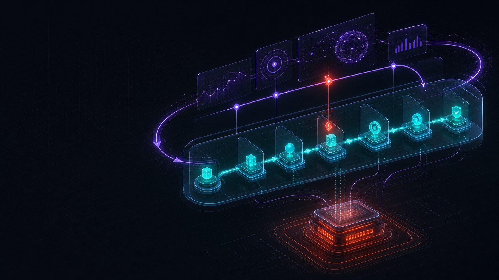
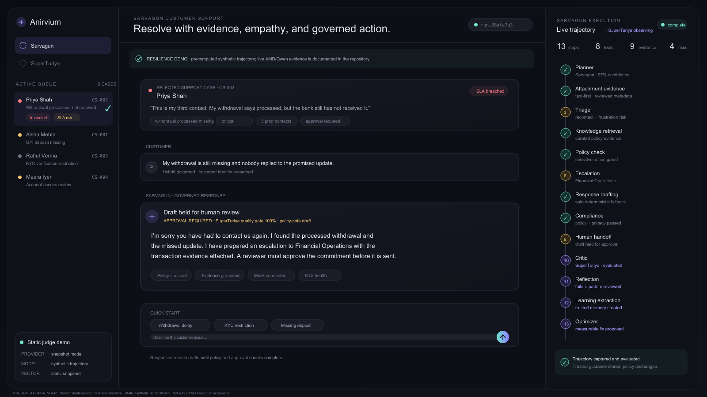
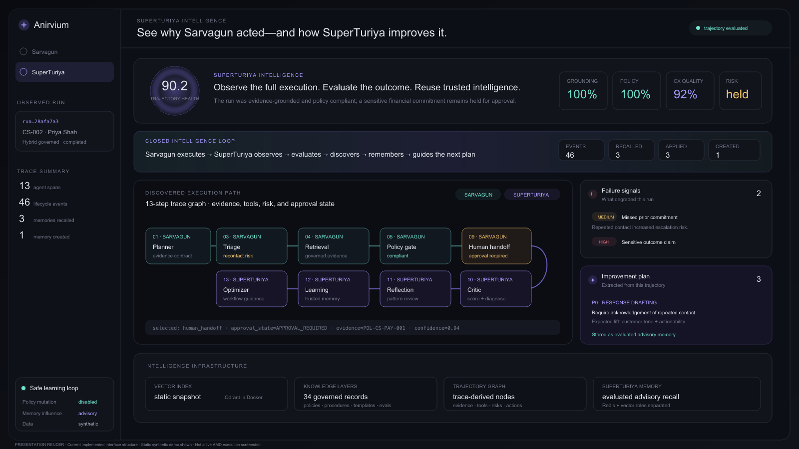
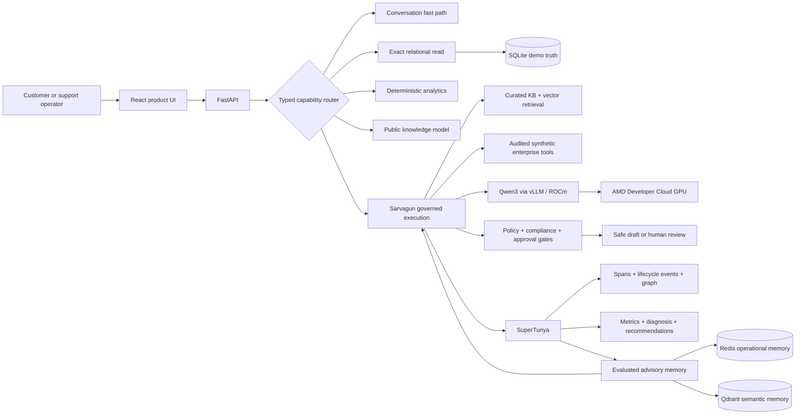

Anirvium AI

### The trajectory-intelligence control plane for enterprise AI agents

[](https://github.com/Anirvium/AMD_Anirvium/actions/workflows/ci.yml)
[](LICENSE)
[](https://lablab.ai/ai-hackathons/amd-developer-hackathon-act-ii)



Anirvium AI combines two connected systems:

- **Sarvagun** is a governed customer-support agentic system. It routes customer requests, reads exact synthetic operational records, retrieves reviewed evidence, invokes audited tools, applies policy and approval gates, and drafts a safe response.
- **SuperTuriya** is the trajectory-intelligence system. It observes the complete execution path, evaluates outcomes, diagnoses failures, compares runs, and stores evaluated advisory intelligence for future planning.

The product does not automatically rewrite policy or deploy code. It turns agent behavior into an inspectable, testable, and safely reusable operational asset.

> **Data boundary:** all customers, cases, transactions, tools, and feedback in this repository are synthetic. Enterprise connectors are simulated and labelled as such.

## Judge path

### URL map — use the row that matches your runtime

| Runtime | Product frontend | Backend/API | What it proves |
| --- | --- | --- | --- |
| Static judge demo deployment target | [https://anirvium.github.io/AMD_Anirvium/](https://anirvium.github.io/AMD_Anirvium/) | No live backend; verified synthetic snapshots are bundled | UI, routing, Sarvagun trajectories, SuperTuriya evaluation, and presentation flow when the AMD notebook is unavailable. Verify the latest Pages workflow before using this URL in the form. |
| Docker Compose — recommended complete run | `http://localhost:5173` | `http://localhost:8000` | Complete containerized product with FastAPI, Redis, Qdrant, and deterministic model fallback. |
| Local development | `http://127.0.0.1:5173` | `http://127.0.0.1:8000` | Same complete application with frontend and backend hot reload. |
| AMD Jupyter port proxy | `https://radeon-global.anruicloud.com/spaces/<instance-id>/8501/` | Browser API: `<frontend-url>api`; VM-only FastAPI: `http://127.0.0.1:8000` | Live AMD/Qwen path when the team notebook instance is active. |

The browser should normally call the backend through the frontend's same-origin `/api` proxy. For example, Docker health is `http://localhost:5173/api/health`; AMD proxy health is `https://radeon-global.anruicloud.com/spaces/<instance-id>/8501/api/health`. Do **not** open the VM's `localhost` URL on another computer.

The GitHub Pages URL is a deliberately labelled resilience demo. It remains interactive but uses precomputed, synthetic trajectory artifacts and never claims that a live AMD model is attached. Use Docker for the complete reproducible backend workflow.

### 1. Run the complete containerized product

The official ACT II requirements call for a containerized, runnable submission. Prerequisites are Git plus Docker Desktop or Docker Engine with the Compose v2 plugin; no API key or `.env` file is required for the default judge path.

```bash
git clone https://github.com/Anirvium/AMD_Anirvium.git
cd AMD_Anirvium
docker compose up --build
```

Wait until all four containers are running and the HTTP checks below succeed, then open:

| Purpose | URL |
| --- | --- |
| Product UI | `http://localhost:5173` |
| Backend through the frontend proxy | `http://localhost:5173/api/health` |
| Direct backend health | `http://localhost:8000/health` |
| Runtime/provider readiness | `http://localhost:8000/health/ready` |
| Interactive OpenAPI/Swagger | `http://localhost:8000/docs` |
| OpenAPI JSON | `http://localhost:8000/openapi.json` |
| Qdrant dashboard (optional inspection) | `http://localhost:6333/dashboard` |

Docker Compose starts the React/Nginx frontend, FastAPI backend, Redis, and Qdrant. It intentionally uses deterministic mock-model mode so judges can reproduce the complete workflow without private GPU credentials.

In a second terminal, verify the chain before using the UI:

```bash
docker compose ps
curl -fsS http://localhost:8000/health
curl -fsS http://localhost:8000/health/ready
curl -fsS http://localhost:5173/api/health
```

All three HTTP checks must return JSON. The Docker readiness response reports the deterministic local provider; that is expected and does not mean the AMD evidence is simulated. The recorded live AMD run is documented separately under [AMD execution evidence](#amd-execution-evidence).

To inspect logs or stop the stack:

```bash
docker compose logs --tail=200 backend frontend redis qdrant
docker compose logs -f backend frontend redis qdrant
docker compose down
```

If ports `5173`, `8000`, or `6333` are already occupied, stop the conflicting service before starting Compose. A `502` from the frontend means the UI is running but cannot reach FastAPI; check `docker compose ps` and the backend logs. A long agent run uses `POST /runs/async` plus job polling, so judges should not call the older synchronous route through a short-timeout proxy.

### 2. Run the canonical scenario

Select `CS-002` and submit:

> This is my third contact. My withdrawal is processed but the bank has not received it, nobody replied to the promised update, and I am extremely frustrated.

Expected proof:

- customer identity and linked case remain consistent;
- recontact, frustration, missed commitment, and escalation risk are detected;
- curated policy, procedure, and template evidence is retrieved;
- audited mock case/payment tools execute with provenance;
- a sensitive commitment is held for human approval;
- thirteen structured spans are visible;
- SuperTuriya scores, diagnoses, and recommends a measurable fix;
- evaluated intelligence is stored for later advisory recall without changing policy.

### 3. Inspect SuperTuriya

Open the **SuperTuriya** tab after the run. Inspect trajectory health, metric cards, the discovered trace graph, failure signals, improvement recommendations, storage state, and the closed intelligence loop.





The two images above are presentation renders built from the implemented interface structure and current synthetic demo output. They are deliberately labelled in-image and are not represented as live AMD screenshots.

## Why this belongs in the Unicorn Track

ACT II Track 3 judges creativity/originality, product/market potential, completeness, and meaningful AMD use. Anirvium is built around those four dimensions:

| Criterion | Submission evidence |
| --- | --- |
| Creativity and originality | A support agent and a separate trajectory-intelligence plane; evaluated memory is advisory and policy-bounded rather than an opaque self-modification loop. |
| Product/market potential | A control plane for support and AI-operations leaders deploying agents in regulated, financial, security-sensitive, or SLA-sensitive workflows. |
| Completeness | Interactive React product, typed API, normalized synthetic operational store, governed KB, audited tool boundary, asynchronous execution, trace graph, evaluator, memory, tests, Docker, and CI. |
| AMD platform use | Qwen3-8B served through vLLM/ROCm on the observed AMD Developer Cloud GPU for response drafting and routed public knowledge; real run evidence is recorded in `amd/benchmark_results_real.md`. |

Track 3 has no fixed speed, token, or accuracy benchmark. Internal metrics are product observability signals, not an official leaderboard score.

## Product architecture



### Request routing

The system avoids running thirteen agents for every prompt.

| Request | Route | Behavior |
| --- | --- | --- |
| Greeting or transition | conversation fast path | Deterministic, low-cost response. |
| `List all customers` | customer directory | Exact read-only SQLite query. |
| `Show all payment-failure cases` | case directory | Filtered read-only operational query. |
| `Open CS-001` | case lookup | Exact linked record and context. |
| Aggregate support question | support analytics | Deterministic aggregation. |
| Public definition | general knowledge | Configured live model; no customer records are sent. |
| Personal support problem | Sarvagun | Governed asynchronous agent pipeline followed by SuperTuriya. |

### Sarvagun execution spans

1. Planner Agent
2. Attachment Evidence Agent
3. Intake / Triage Agent
4. Knowledge Retrieval Agent
5. Policy Checker Agent
6. Escalation Agent
7. Response Drafting Agent
8. Compliance Agent
9. Human Escalation Agent

Sarvagun supports `policy_driven`, `plan_driven`, `autonomous`, and `hybrid` execution modes. Autonomous behavior is bounded by allowlisted actions, stop conditions, a two-decision loop, policy supervision, and human approval.

### SuperTuriya intelligence spans

10. Critic / Evaluator Agent
11. Reflection Agent
12. Learning Extraction Agent
13. Optimizer Agent

SuperTuriya records safe public decision summaries, tools, evidence, latency, token estimates, confidence, risk flags, approval state, evaluation metrics, diagnosis, recommendations, memory IDs, and graph relationships. It does not expose hidden chain-of-thought.

## Storage and memory contract

Each store has one job:

- **SQLite** is the hackathon source of truth for exact synthetic customers, cases, accounts, transactions, verification records, approvals, escalations, workflow states, runs, evaluations, tool executions, and feedback.
- **Redis** is short-term operational memory for sessions and active execution context. Local in-process fallback is explicit when Redis is unavailable.
- **Qdrant** holds semantic KB, evaluated memory, and trajectory collections. Local deterministic vectors are the offline fallback.
- **JSON trajectory files** preserve full-fidelity run artifacts for debugging and graph export.

Vector collections:

- `anirvium_sarvagun_kb`
- `anirvium_superturiya_memory`
- `anirvium_superturiya_trajectories`

Only artifacts marked as evaluated SuperTuriya memory may influence future planning, and current policy is always revalidated.

## AMD execution evidence

The live text path was exercised on AMD Developer Cloud with the runtime that was actually exposed to the team:

```text
visible VRAM: 51,522,830,336 bytes / 47.98 GiB
ROCm target: gfx1100
vLLM endpoint: OpenAI-compatible /v1
served model: anirvium-text
underlying model: Qwen/Qwen3-8B
```

Verified internal run summary:

```text
13 trajectory spans
72.53 average tokens/second across the recorded benchmark
190.18 seconds average benchmark latency
1.0 policy compliance
1.0 evidence grounding
70.9 average internal trajectory score
```

These numbers are not an official hackathon score and are not presented as MI300X results. The larger 192GB profile is documented only as a target runtime profile.

Evidence and runbooks:

- [Real AMD results](amd/benchmark_results_real.md)
- [AMD usage and reproduction](amd/README_AMD_USAGE.md)
- [Runtime profiles](amd/RUNTIME_PROFILES.md)
- [Benchmark runner](amd/benchmark_agent_eval.py)

## Manual development setup

### Backend

Python 3.10+ is supported; CI uses Python 3.11.

```bash
cd backend
python -m venv .venv
source .venv/bin/activate
pip install -r requirements.txt
LLM_PROVIDER=mock uvicorn app.main:app --reload --port 8000
```

### Frontend

Node 20 is recommended.

```bash
cd frontend
npm ci
npm run dev
```

Open `http://127.0.0.1:5173`. Confirm `http://127.0.0.1:5173/api/health` before starting a run. Vite proxies `/api` to `http://127.0.0.1:8000`; the production Docker image serves the frontend with Nginx and proxies `/api` to the backend service.

### Live AMD model mode

On AMD Developer Cloud, first use the Python environment that contains ROCm vLLM. Do not install vLLM inside the lightweight FastAPI virtual environment.

```bash
source /opt/venv/bin/activate
python -c 'import vllm; print(vllm.__version__)'
export PYTHON_BIN=/opt/venv/bin/python
export PROFILE=text_48gb
bash amd/run_runtime_profile.sh 2>&1 | tee /workspace/anirvium_vllm.log
```

If `/opt/venv` differs on the current AMD image, activate the platform-provided ROCm/vLLM environment and repeat the `import vllm` preflight. Never launch vLLM from `backend/.venv`; that lightweight environment intentionally contains only the FastAPI application dependencies.

Then start the backend with:

```bash
cd backend
source .venv/bin/activate
export LLM_BASE_URL=http://localhost:8001/v1
export LLM_API_KEY=dummy
export LLM_MODEL=anirvium-text
export LLM_PROVIDER=openai_compatible
export AMD_RUNTIME_PROFILE=text_48gb
uvicorn app.main:app --host 0.0.0.0 --port 8000
```

The AMD Jupyter frontend gateway instructions are in [docs/LIVE_PRODUCT_DEMO_RUNBOOK.md](docs/LIVE_PRODUCT_DEMO_RUNBOOK.md).

For an active AMD instance, the judge-facing frontend is:

```text
https://radeon-global.anruicloud.com/spaces/<instance-id>/8501/
```

Replace `<instance-id>` with the current notebook ID. Start the gateway with the matching base path:

```bash
cd /workspace/AMD_Anirvium/frontend
export FRONTEND_PORT=8501
export FRONTEND_HOST=0.0.0.0
export BACKEND_BASE_URL=http://127.0.0.1:8000
export FRONTEND_BASE_PATH=/spaces/<instance-id>/8501
npm ci
npm run serve:amd
```

The browser-visible API health URL is `https://radeon-global.anruicloud.com/spaces/<instance-id>/8501/api/health`. Ports `8000` and `8001` remain internal to the VM. The proxy frontend is the only browser URL for a currently authorized, live AMD session; it is ephemeral and is not the durable submission URL. External AMD API inspection should use `<frontend-url>api/openapi.json`; nested Swagger HTML is not advertised because its root-relative schema URL is incompatible with this notebook base path.

## API proof path

Health and inventory:

```bash
curl http://localhost:8000/health
curl http://localhost:8000/health/ready
curl http://localhost:8000/platform/status
curl http://localhost:8000/data/status
```

Fast typed routes:

```bash
curl -sS -X POST http://localhost:8000/conversations/turn \
  -H 'Content-Type: application/json' \
  -d '{"message":"List all customers"}'

curl -sS -X POST http://localhost:8000/conversations/turn \
  -H 'Content-Type: application/json' \
  -d '{"message":"Show all payment-failure cases"}'
```

Recoverable agent execution:

```bash
curl -sS -X POST http://localhost:8000/runs/async \
  -H 'Content-Type: application/json' \
  -d '{
    "dataset":"customer_support",
    "selection_mode":"selected",
    "selected_ticket_ids":["CS-002"],
    "customer_query":"This is my third contact. My withdrawal is processed but the bank has not received it, nobody replied to the promised update, and I am extremely frustrated.",
    "execution_mode":"hybrid"
  }'
```

Poll the returned job at `GET /runs/jobs/{job_id}`. Then inspect:

```bash
curl http://localhost:8000/runs/latest
curl http://localhost:8000/runs/latest/trajectory
curl http://localhost:8000/runs/latest/evaluation
curl http://localhost:8000/runs/latest/trajectory/graph-discovery
```

## Evaluation

The deterministic product evaluator covers:

- task completion;
- evidence grounding;
- policy compliance;
- hallucination risk;
- escalation quality;
- actionability;
- missing information;
- customer tone;
- token efficiency;
- latency efficiency;
- overall trajectory health.

These internal metrics support regression testing and run comparison. Anirvium has not run an official τ-bench, τ²-bench, or τ³-bench evaluation; no such score is claimed.

## Verification

Local release checks on the submission working tree:

```text
backend: 95 tests passed
frontend: TypeScript + Vite production build passed
static judge mode: TypeScript + Vite production build passed
secret-pattern scan: no committed API credential pattern found
GitHub repository: public
license: MIT
```

GitHub Actions runs backend tests, the frontend build, and a complete Docker Compose smoke test.

## Honest prototype boundary

Implemented and demonstrable:

- synthetic end-to-end support execution;
- typed routing and exact operational reads;
- governed 13-span workflow;
- AMD/Qwen response-generation path with safe fallback;
- audited simulated enterprise connectors;
- policy, compliance, approval, CX, provenance, and transcript state;
- asynchronous jobs with progress polling;
- SuperTuriya evaluation, trace graph, run comparison, and evaluated memory loop;
- containerized local stack and CI.

Not production-complete:

- live CRM, ticketing, payment, identity, Slack, or Citrix adapters;
- production authentication, tenant isolation, and reviewer authorization;
- durable distributed job orchestration and cancellation;
- token-by-token streaming;
- managed PostgreSQL and production Qdrant/Redis operations;
- OpenTelemetry export and centralized monitoring;
- automatic prompt, policy, or code deployment;
- official external benchmark results.

## Product and submission documents

- [PRODUCT_0_1 — complete product story and delivery plan](docs/PRODUCT_0_1.md)
- [Judges read this first](JUDGES_READ_THIS_FIRST.md)
- [Judge walkthrough](docs/JUDGE_WALKTHROUGH.md)
- [Final submission form copy](docs/FINAL_SUBMISSION_FORM.md)
- [Sarvagun/SuperTuriya architecture](docs/SARVAGUN_SUPERTURIYA_ARCHITECTURE.md)
- [Principal engineering audit](docs/PRINCIPAL_AGENTIC_AI_AUDIT_2026-07-12.md)
- [τ-bench and storage strategy](docs/TAU_BENCH_AND_STORAGE_STRATEGY.md)
- [Final pitch deck source](docs/FINAL_TEAM_PITCH_DECK.md)
- [Final ACT II presentation deck](docs/assets/Anirvium_AI_ACT_II_Deck.pptx)
- [Narrated ACT II fallback video — 4:08, 5.4 MB](docs/assets/Anirvium_AI_ACT_II_Video.mp4)

## License

Code and project-authored documentation are released under the [MIT License](LICENSE). Team-supplied anonymized reference material is not used as raw generation context; reviewed runtime records under `backend/app/data/kb_layers/` are the product KB. See [knowledge-base provenance](docs/kb/README.md) before reusing source material.
