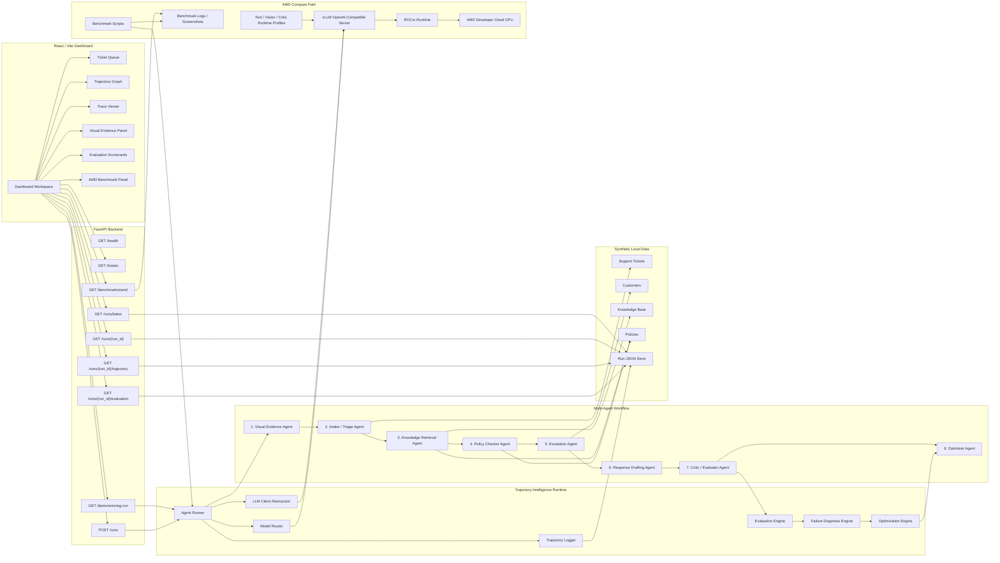
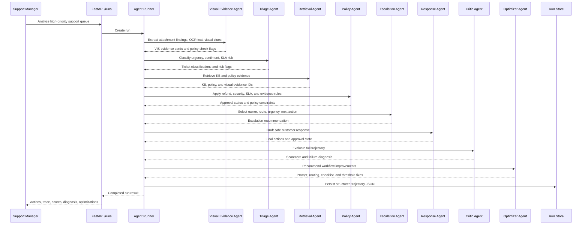
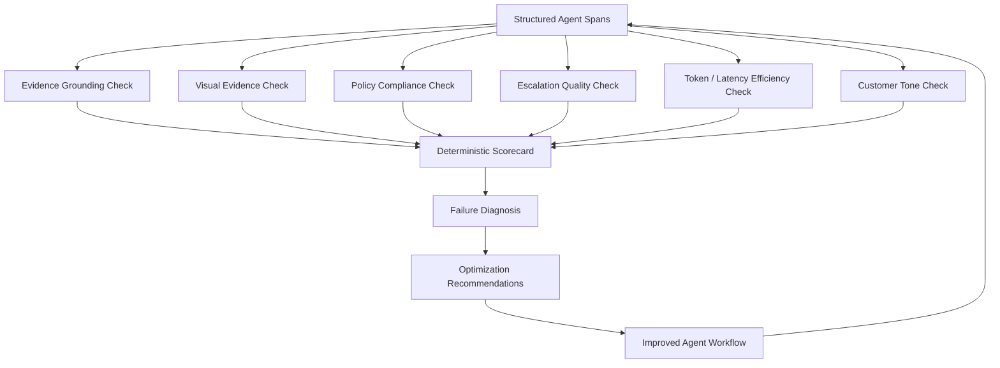
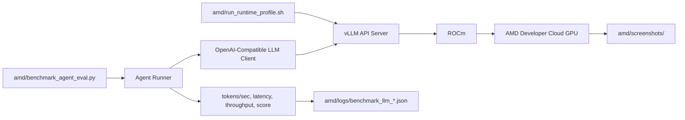

# Anirvium AI Architecture Diagram

## System Architecture

```mermaid
flowchart LR
  subgraph Frontend["React / Vite Dashboard"]
    UI["Dashboard Workspace"]
    Queue["Ticket Queue"]
    Graph["Trajectory Graph"]
    Trace["Trace Viewer"]
    VisualPanel["Visual Evidence Panel"]
    Scores["Evaluation Scorecards"]
    AMDPanel["AMD Benchmark Panel"]
  end

  subgraph API["FastAPI Backend"]
    Health["GET /health"]
    Tickets["GET /tickets"]
    Demo["GET /demo/winning-run"]
    Runs["POST /runs"]
    Latest["GET /runs/latest"]
    RunRead["GET /runs/{run_id}"]
    Trajectory["GET /runs/{run_id}/trajectory"]
    Evaluation["GET /runs/{run_id}/evaluation"]
    Benchmarks["GET /benchmarks/amd"]
  end

  subgraph Runner["Trajectory Intelligence Runtime"]
    AgentRunner["Agent Runner"]
    Logger["Trajectory Logger"]
    EvalEngine["Evaluation Engine"]
    Diagnosis["Failure Diagnosis Engine"]
    OptimizerService["Optimization Engine"]
    LLMClient["LLM Client Abstraction"]
    ModelRouter["Model Router"]
  end

  subgraph Agents["Multi-Agent Workflow"]
    Visual["1. Visual Evidence Agent"]
    Triage["2. Intake / Triage Agent"]
    Retrieval["3. Knowledge Retrieval Agent"]
    Policy["4. Policy Checker Agent"]
    Escalation["5. Escalation Agent"]
    Response["6. Response Drafting Agent"]
    Critic["7. Critic / Evaluator Agent"]
    OptimizerAgent["8. Optimizer Agent"]
  end

  subgraph Data["Synthetic Local Data"]
    TicketsData["Support Tickets"]
    Customers["Customers"]
    KB["Knowledge Base"]
    Policies["Policies"]
    RunStore["Run JSON Store"]
  end

  subgraph AMD["AMD Compute Path"]
    VLLM["vLLM OpenAI-Compatible Server"]
    ROCm["ROCm Runtime"]
    GPU["AMD Developer Cloud GPU"]
    Profiles["Text / Vision / Critic Runtime Profiles"]
    Benchmark["Benchmark Scripts"]
    Logs["Benchmark Logs / Screenshots"]
  end

  UI --> Queue
  UI --> Graph
  UI --> Trace
  UI --> VisualPanel
  UI --> Scores
  UI --> AMDPanel

  UI --> Tickets
  UI --> Demo
  UI --> Runs
  UI --> Latest
  UI --> RunRead
  UI --> Trajectory
  UI --> Evaluation
  UI --> Benchmarks

  Demo --> AgentRunner
  Runs --> AgentRunner
  Latest --> RunStore
  RunRead --> RunStore
  Trajectory --> RunStore
  Evaluation --> RunStore
  Benchmarks --> Logs

  AgentRunner --> Visual
  Visual --> Triage
  Triage --> Retrieval
  Retrieval --> Policy
  Policy --> Escalation
  Escalation --> Response
  Response --> Critic
  Critic --> OptimizerAgent

  AgentRunner --> Logger
  Logger --> RunStore

  Critic --> EvalEngine
  EvalEngine --> Diagnosis
  Diagnosis --> OptimizerService
  OptimizerService --> OptimizerAgent

  Triage --> TicketsData
  Retrieval --> KB
  Retrieval --> Policies
  Escalation --> Customers
  Policy --> Policies

  AgentRunner --> ModelRouter
  AgentRunner --> LLMClient
  LLMClient --> VLLM
  ModelRouter --> VLLM
  VLLM --> ROCm
  Profiles --> VLLM
  ROCm --> GPU
  Benchmark --> AgentRunner
  Benchmark --> Logs
```

## Agent Workflow

```mermaid
sequenceDiagram
  participant Manager as Support Manager
  participant API as FastAPI /runs
  participant Runner as Agent Runner
  participant Visual as Visual Evidence Agent
  participant Triage as Triage Agent
  participant Retrieval as Retrieval Agent
  participant Policy as Policy Agent
  participant Escalation as Escalation Agent
  participant Response as Response Agent
  participant Critic as Critic Agent
  participant Optimizer as Optimizer Agent
  participant Store as Run Store

  Manager->>API: Analyze high-priority support queue
  API->>Runner: Create run
  Runner->>Visual: Extract attachment findings, OCR text, visual clues
  Visual-->>Runner: VIS evidence cards and policy-check flags
  Runner->>Triage: Classify urgency, sentiment, SLA risk
  Triage-->>Runner: Ticket classifications and risk flags
  Runner->>Retrieval: Retrieve KB and policy evidence
  Retrieval-->>Runner: KB, policy, and visual evidence IDs
  Runner->>Policy: Apply refund, security, SLA, and evidence rules
  Policy-->>Runner: Approval states and policy constraints
  Runner->>Escalation: Select owner, route, urgency, next action
  Escalation-->>Runner: Escalation recommendation
  Runner->>Response: Draft safe customer response
  Response-->>Runner: Final actions and approval state
  Runner->>Critic: Evaluate full trajectory
  Critic-->>Runner: Scorecard and failure diagnosis
  Runner->>Optimizer: Recommend workflow improvements
  Optimizer-->>Runner: Prompt, routing, checklist, and threshold fixes
  Runner->>Store: Persist structured trajectory JSON
  Runner-->>API: Completed run result
  API-->>Manager: Actions, trace, scores, diagnosis, optimizations
```

## Evaluation And Optimization Loop

```mermaid
flowchart TD
  Span["Structured Agent Spans"] --> Evidence["Evidence Grounding Check"]
  Span --> VisualEvidence["Visual Evidence Check"]
  Span --> Policy["Policy Compliance Check"]
  Span --> Escalation["Escalation Quality Check"]
  Span --> Efficiency["Token / Latency Efficiency Check"]
  Span --> Tone["Customer Tone Check"]

  Evidence --> Metrics["Deterministic Scorecard"]
  VisualEvidence --> Metrics
  Policy --> Metrics
  Escalation --> Metrics
  Efficiency --> Metrics
  Tone --> Metrics

  Metrics --> Failures["Failure Diagnosis"]
  Failures --> Fixes["Optimization Recommendations"]
  Fixes --> Workflow["Improved Agent Workflow"]
  Workflow --> Span
```

## AMD Benchmark Path

```mermaid
flowchart LR
  Benchmark["amd/benchmark_agent_eval.py"] --> Runner["Agent Runner"]
  Runner --> LLMClient["OpenAI-Compatible LLM Client"]
  Profiles["amd/run_runtime_profile.sh"] --> VLLM["vLLM API Server"]
  LLMClient --> VLLM["vLLM API Server"]
  VLLM --> ROCm["ROCm"]
  ROCm --> GPU["AMD Developer Cloud GPU"]
  Runner --> Metrics["tokens/sec, latency, throughput, score"]
  Metrics --> Logs["amd/logs/benchmark_llm_*.json"]
  GPU --> Screenshots["amd/screenshots/"]
```
