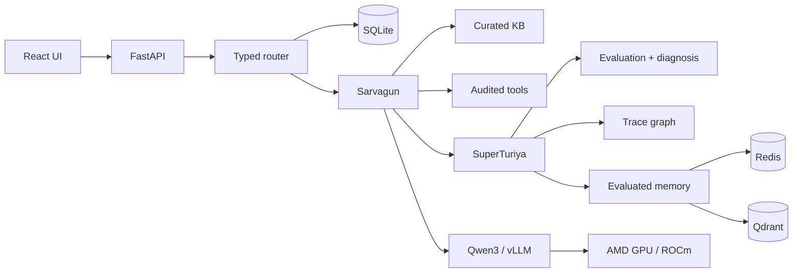

# Anirvium AI — Final Pitch Deck Source

Target length: 12 slides, 4–5 minutes. Lead with product value; use AMD evidence as the enabling infrastructure proof.

## Slide 1 — Title

**Anirvium AI**  
**The Control Plane for AI Agents**

Sarvagun governed execution × SuperTuriya trajectory intelligence

Visual: `docs/assets/anirvium-cover-16x9.png`

Speaker line: “AI agents are becoming enterprise infrastructure, but most companies can see only the final answer. Anirvium makes the full decision path observable, governable, and safely improvable.”

## Slide 2 — The problem

**Enterprise AI agents fail silently.**

- Which evidence did the agent use?
- Which tool changed state?
- Which policy controlled the decision?
- Why did a failure repeat?
- What should change before the next run?

Speaker line: “A transcript is not an audit trail. In payment, identity, refund, security, and SLA workflows, hidden failure paths become customer harm and operating risk.”

## Slide 3 — The product insight

**The winning enterprise AI layer is not only the chatbot. It is trajectory intelligence.**

Most products optimize the final response. Anirvium observes and improves the complete governed path.

```text
Sarvagun executes
→ SuperTuriya observes
→ evaluates and diagnoses
→ stores evaluated intelligence
→ guides the next plan under current policy
```

## Slide 4 — Two connected systems

### Sarvagun

- typed request routing;
- exact operational records;
- governed evidence retrieval;
- audited tool execution;
- policy, compliance, and approval gates;
- safe response drafting.

### SuperTuriya

- traces agents, tools, evidence, and risk;
- scores and diagnoses each run;
- compares execution paths;
- generates measurable improvements;
- stores only evaluated advisory memory;
- never mutates policy automatically.

## Slide 5 — Live product experience

Visual: `docs/assets/anirvium-main-ui-render.png`

Callouts:

- real support queue and selected synthetic case;
- response, evidence, approval, and provenance in one workspace;
- complete thirteen-step rail;
- transparent static/live model state.

Speaker line: “This is not a college chatbot screen. The support operator sees the case, safe draft, evidence, policy status, tool provenance, and execution state without leaving the workflow.”

## Slide 6 — Canonical demo: CS-002

**Priya Shah contacts support for the third time. Her withdrawal says processed; her bank has not received it; a promised update was missed.**

Sarvagun:

1. preserves Priya’s selected identity and linked case;
2. detects recontact, frustration, and escalation risk;
3. retrieves governed payment evidence;
4. executes audited simulated case/payment tools;
5. routes to Financial Operations;
6. holds the sensitive commitment for review.

## Slide 7 — SuperTuriya: the differentiator

Visual: `docs/assets/anirvium-superturiya-ui-render.png`

Callouts:

- trajectory health and metric cards;
- discovered Sarvagun → SuperTuriya graph;
- evidence/tools/risk on each node;
- failure signals and target agents;
- improvement recommendations;
- recalled, applied, and created memory IDs.

Speaker line: “SuperTuriya does not pretend to learn by silently rewriting prompts. It creates evaluated, traceable guidance and forces every future plan back through current policy.”

## Slide 8 — Architecture and completeness



Proof: Docker Compose, CI, typed schemas, 95 backend tests, normal/static production builds.

## Slide 9 — Why AMD matters

**Open, self-hosted inference for a product that inspects every agent decision.**

Verified event path:

- AMD Developer Cloud;
- 47.98 GiB visible VRAM / `gfx1100` observed runtime;
- ROCm + vLLM OpenAI-compatible server;
- Qwen3-8B served as `anirvium-text`;
- live model used for response drafting and routed public knowledge;
- deterministic safety systems preserved around the model.

Internal evidence: 13 steps, 72.53 average tokens/s, 1.0 policy compliance, 1.0 evidence grounding. These are product diagnostics, not a Track 3 leaderboard score.

## Slide 10 — Product/market potential

### Beachhead buyer

Support operations and AI-platform leaders deploying agents in regulated or SLA-sensitive workflows.

### Initial value

- reduce manual trajectory review;
- catch unsafe commitments before delivery;
- shorten failure diagnosis;
- build reusable evidence for audits and regression tests;
- improve workflows without opaque self-modification.

### Pricing hypothesis

Platform fee plus metered evaluated trajectories, with enterprise private-cloud and compliance tiers.

### Expansion

Customer support first; then claims, lending operations, IT service management, procurement, and other governed agent systems.

## Slide 11 — Differentiation

| Alternative | What it shows | Anirvium difference |
| --- | --- | --- |
| Generic support chatbot | final answer | governed execution plus operational context |
| Trace/LLM observability tool | spans and latency | domain policy, approvals, failure diagnosis, and reusable evaluated intelligence |
| Autonomous self-improving agent | opaque behavior change | bounded, advisory learning with policy revalidation |
| Manual QA | sampled transcripts | structured, comparable trajectory evidence |

Speaker line: “We are not replacing observability. We are moving from traces as logs to trajectories as governed operational intelligence.”

## Slide 12 — Close

**Sarvagun executes. SuperTuriya understands the execution. Anirvium turns that understanding into safer future work.**

Current truth:

- complete synthetic-data prototype;
- real AMD text-generation path validated;
- reproducible container mode;
- production connectors, auth, tenancy, durable jobs, and managed data remain roadmap items.

Call to action: design partners operating high-volume, high-risk customer-support agents.

## Presentation rules

- Keep the final video under five minutes and 300 MB.
- Do not claim the presentation renders are live AMD screenshots.
- Do not claim MI300X, Fireworks, Gemma, real enterprise connectors, production readiness, automatic policy mutation, or an official τ score.
- Put the public repository and verified application URL on the final slide.
