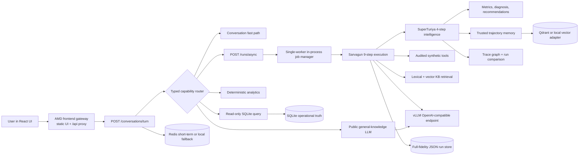

# Principal Agentic AI Engineering Audit

**Product:** Anirvium AI
**Execution system:** Sarvagun
**Trajectory-intelligence system:** SuperTuriya
**Audit date:** 2026-07-12
**Audit basis:** source-code inspection, API and schema tracing, local backend test execution, frontend production build, and review of the supplied AMD runtime logs.
**Claim boundary:** all customer, case, policy, tool, and operational data in the current product is synthetic.

## Executive verdict

**Hackathon functional-demo verdict: CONDITIONAL GREEN.** The repository now contains a coherent, testable customer-support execution system and a visible trajectory-intelligence layer. It can demonstrate typed request routing, a governed 13-step support workflow, evidence and policy gates, simulated enterprise tools, real trace-derived UI, deterministic evaluation, run comparison, and memory reuse.

**Production verdict: NO-GO.** It lacks production identity and tenant authorization, real enterprise connectors, a durable distributed job queue, persistent default memory services on the AMD notebook path, OpenTelemetry export, browser end-to-end tests, production deployment automation, production-grade embeddings/reranking, and an independently reproduced external benchmark result.

This is the right submission posture:

> Anirvium is a competition-grade, synthetic-data prototype that executes customer-support workflows through Sarvagun and makes those executions observable, evaluable, comparable, and reusable through SuperTuriya. It is not a deployed autonomous system making real customer or financial changes.

Do not describe it as production-ready, continuously self-modifying, trained on customer data, officially τ-bench validated, or integrated with a live CRM.

## Verification performed for this audit

| Check | Result | What it proves |
| --- | --- | --- |
| `cd backend && .venv/bin/pytest -q` | **95 passed** | Current backend schemas, routing, lifecycle, memory, relational chains, approval, comparison, observability, and API contracts pass locally. |
| `cd frontend && npm run build` | **Passed**; 1,746 modules transformed | TypeScript compiles and Vite produces a production bundle. |
| Repository search for τ/τ²/τ³ integration | No dependency, adapter, task corpus, trajectory output, or score found | The product has **not** run an official τ benchmark. |
| Current relational status | SQLite schema `sarvagun-operational-v1`; 6 customers, 13 cases, 6 accounts, 5 transactions, 6 verification records, 6 approvals, 5 escalations, 13 workflow states, and 10 internal evaluation cases | Structured support data is normalized and queryable with zero FK violations; it remains a small synthetic corpus. |
| Curated KB status | 34 records across policies, procedures, templates, and evaluation cases | Retrieval is connected to a governed corpus, but the corpus is not yet broad enough for production. |

These are local code-level checks. The final release gate is still to pull the exact submission commit into the AMD notebook, restart all three processes, and repeat the live public-URL walkthrough. A local green suite does not prove that the AMD notebook is running the same commit.

## What the product now solves

Sarvagun is the execution plane for customer-support work. It accepts a conversational request, selects a typed capability, performs a low-cost direct read when a full agent run is unnecessary, or executes a governed support workflow when the request can affect a case, policy, approval, or escalation.

SuperTuriya is the intelligence plane. It observes the executed path, records spans and lifecycle events, scores the result, diagnoses failures, recommends changes, stores evaluated trajectory intelligence, recalls trusted prior intelligence, and compares persisted runs. It does **not** automatically rewrite policies or deploy code.

The current value proposition is therefore precise:

1. resolve or route synthetic support cases safely;
2. show exactly which agents, tools, evidence, and policy gates were involved;
3. distinguish generated output from deterministic fallback output;
4. compare candidate trajectories with a prior run;
5. reuse evaluated lessons without allowing memory to override current policy.

## Runtime architecture



### Exact request paths

| Request category | Current route | Runtime behavior |
| --- | --- | --- |
| Greeting or transition | `conversation_fast_path` | Deterministic conversational response; no expensive run. |
| “List all customers” | `customer_directory` → `direct_relational_read` | Exact, read-only SQLite query over seeded customer records. |
| “Show payment-failure cases” | `payment_failure_cases` → `direct_relational_read` | Queries deposit-missing and withdrawal-missing cases; current seed returns five records. |
| Customer/case lookup | `customer_lookup` or `case_lookup` | Exact normalized record lookup. |
| Aggregate/count question | `support_analytics` | Deterministic aggregation over SQLite rows. |
| Public definition | `general_knowledge` | Live configured LLM when available; truthful degraded response in mock mode. No business records are included. |
| Personal support problem | `support_case_execution` | Asynchronous, governed Sarvagun + SuperTuriya run. |

This directly fixes the earlier generic-response failure: business-data questions are no longer forced through a support template, and public definitions are no longer treated as unsupported small talk.

## Sarvagun execution audit

### Implemented agents and order

Every governed support request currently uses this fixed 13-span topology:

1. Planner Agent
2. Attachment Evidence Agent
3. Intake / Triage Agent
4. Knowledge Retrieval Agent
5. Policy Checker Agent
6. Escalation Agent
7. Response Drafting Agent
8. Compliance Agent
9. Human Escalation Agent
10. Critic / Evaluator Agent
11. Reflection Agent
12. Learning Extraction Agent
13. Optimizer Agent

The first nine spans are Sarvagun execution. The final four are the SuperTuriya intelligence stage.

### What is genuinely dynamic

- A typed router separates conversational, relational, analytical, general-knowledge, and support-execution capabilities.
- Support intent can change the issue profile while preserving the explicitly selected customer identity.
- Execution mode accepts `policy_driven`, `plan_driven`, `autonomous`, or `hybrid`.
- The lifecycle controller varies decision authority, bounded autonomous scope, selected tools, stop conditions, escalation, and approval requirements.
- Customer emotion, repeat contact, missed commitments, incident signals, policy evidence, and recalled trusted memories influence the run.
- The text model can draft a response through the AMD vLLM endpoint; unsafe, empty, or failed output is rejected in favor of a deterministic safe draft.

### What is not yet genuinely dynamic

- The 13-agent topology does not change for governed support requests.
- “Autonomous” mode records two bounded controller decisions; it is not an open-ended select-agent → execute → observe → replan loop.
- There is one replan limit in the schema, but no general retry/replanning engine that changes topology after a failed step.
- Most planning, classification, policy, escalation, evaluation, and optimization behavior is deterministic Python logic.
- Direct reads intentionally do not create a 13-step trajectory. Their route metadata is observable in the conversation API/session but is not a full SuperTuriya run.

The correct description is **hybrid governed orchestration with bounded autonomy**, not fully autonomous multi-agent execution.

## Tool and workflow audit

### Implemented

- A `CustomerSystemConnector` abstraction defines customer, case, history, write, transcript, escalation, and operational-status operations.
- Tool operations are allowlisted and classified as read or write.
- Executions record tool ID, operation, authorization, idempotency key, timeout, latency, before/after state, result, error, and audit ID.
- Sensitive actions can stop at `approval_required`.
- Tool calls are idempotently reused within the process.
- Tool records are included in traces, provenance, transcripts, and SQLite run persistence.

### Important limitation

The active connector is `MockConnector`. All enterprise operations are synthetic and process-local. `create_case`, `update_case`, notes, transcripts, and escalations do not mutate a real CRM, payment system, identity service, or ticketing platform. The UI must continue to label these operations as simulated.

### Workflow coverage

The synthetic cases and rules exercise deposit missing, withdrawal missing, verification restriction, bonus dispute, cross-account access, priority exceptions, billing/refund, security/deletion, integration failure, outage, and related escalation paths. Accounts, transactions, verification records, approvals, escalations, and ordered workflow states are now normalized and FK-linked for the demo. They are deterministic seed snapshots: live mock-tool calls do not yet apply every resulting state transition to those tables, and no real ledger or enterprise system is connected.

## Model inventory: truthful current state

| Role | Active implementation | Configured but inactive alternative | Important settings |
| --- | --- | --- | --- |
| Sarvagun text generation | `LLM_MODEL` through an OpenAI-compatible client when `LLM_PROVIDER` is live; recent AMD logs served `anirvium-text` backed by Qwen3-8B | `llm_text_model=Qwen/Qwen3-14B` is configuration metadata, not the active served model | temperature 0.1; max tokens 384; timeout 60s; thinking disabled when server supports it |
| General knowledge | Same active OpenAI-compatible text client | None | Public knowledge only; no live search or citations |
| Safe fallback response | `deterministic-safe-response-v2` | None | Used when LLM is absent, fails, returns empty text, or violates unsafe-output checks |
| SuperTuriya critic/evaluator | `deterministic-trajectory-evaluator-v1` | `deepseek-ai/DeepSeek-R1-Distill-Qwen-32B` configured; only used if auxiliary LLM review is explicitly enabled, and the implementation still uses the shared client | Auxiliary review disabled by default |
| Embedding | deterministic signed token hash, 64 dimensions | `Qwen/Qwen3-Embedding-4B` configured only | External embedding model is not called |
| Reranking | deterministic lexical/vector rank fusion | `Qwen/Qwen3-Reranker-4B` configured only | No learned reranker is active |
| Classification/guardrails | deterministic rules | None | No classifier or guardrail model call |
| Visual evidence | deterministic lightweight evidence extraction | Image/video model deferred | Text-first AMD profile |

The repository does not operate five live models. In the demonstrated AMD configuration, there is one live generation model; all other roles are deterministic or optional.

## Knowledge, relational data, and memory audit

### Relational operational truth — implemented

SQLite now persists normalized support queues, customers, support cases, accounts, transactions, verification records, approval requests, escalations, workflow states, evaluation cases, conversation sessions and turns, agent runs, evaluations, tool executions, and explicit feedback. Foreign keys and WAL mode are enabled, and the seed passes `PRAGMA foreign_key_check`. This is the correct store for exact filters, joins, identities, status, ownership, and idempotent operational records.

At audit time, the seed-level domain contained six customers, thirteen cases, six accounts, five transactions, six verification records, six approvals, five escalations, thirteen workflow states, and ten curated internal evaluation cases. This is adequate for a coherent demo, not for evidence of scale or domain coverage.

### Curated knowledge base — implemented, small

The active corpus contains 34 records across four layers:

- 8 policies;
- 8 procedures;
- 8 response templates;
- 10 internal evaluation cases.

Search combines lexical retrieval with local or Qdrant-backed vector similarity and filters by domain/layer. Evaluation cases are excluded from generation-safe LLM evidence.

### Short-term memory — partial

- With `MEMORY_BACKEND=redis`, recent session turns are stored under `anirvium:sarvagun:session:*`, bounded and expired with a TTL.
- The same records are mirrored in process-local memory.
- If Redis is unavailable or disabled, only process-local fallback remains.
- Mid-term summaries are process-local, even when Redis is configured.

### Long-term trajectory memory — implemented with deployment caveats

- Completed runs write a trajectory document and an evaluated summary.
- Redacted synthetic transcripts write a third long-term memory artifact.
- Future support runs retrieve only memories with `trust_scope=superturiya_evaluated_memory` and approved memory types.
- Recalled memory is advisory and cannot override current policy.
- Qdrant is optional; the default local vector index is process memory and is not durable across a restart except for limited rehydration from recent JSON runs.

The full storage decision and collection contract are specified in `docs/TAU_BENCH_AND_STORAGE_STRATEGY.md`.

## SuperTuriya audit

### Implemented intelligence loop

SuperTuriya produces and persists:

- 13 typed trajectory spans with parent edges;
- lifecycle events for messages, memory, agents, tools, evidence, policy, quality, response, transcript, and closure;
- safe reasoning summaries rather than hidden chain-of-thought;
- latency, estimated token counts, model labels, confidence, evidence IDs, risk flags, and approval states;
- deterministic metrics, diagnosis, and optimization recommendations;
- discovered agent path, successes, failures, recalled/applied memory IDs, and created memory IDs;
- an expanded local property graph with run, span, evidence, risk, tool, diagnosis, action, conversation, customer, transcript, escalation, incident, and memory entities;
- deterministic comparison between a baseline and candidate run, including path signature, metric deltas, latency/tokens/tools/evidence, failures, risks, and a safety-overriding verdict.

### Continuous-improvement claim boundary

The loop is:

```text
execute → observe → evaluate → recommend → store evaluated memory
        → retrieve trusted prior memory → influence future planning/drafting
```

It is **not**:

```text
execute → automatically rewrite prompts/policies/code → deploy unreviewed behavior
```

`automatic_policy_mutation` is correctly false. This is a safety strength, not a deficiency to hide.

### Partial or missing intelligence capabilities

- Recommendations are generated, but there is no controlled experiment service that automatically creates and evaluates a candidate workflow.
- Run comparison is available through the backend but not yet exposed as a complete compare-two-runs UI.
- No cross-run aggregate mining detects bottlenecks over a large population of trajectories.
- No calibrated LLM judge is active by default.
- The local property graph is generated on demand; Neo4j is only represented by sample Cypher and is not a required active store.
- Direct relational/general-knowledge routes do not yet produce the same rich graph as support runs.

## Frontend and live-demo audit

### Implemented

- React 18 + TypeScript + Vite production application.
- Minimal central conversation workspace with one selected case, prompt composer, execution-mode control, progress, answer state, and feedback.
- Backend-connected support-ticket queue; `CS-001`, `CS-002`, and similar IDs are seeded support cases, not trajectory IDs or fake HTML placeholders.
- Runtime, model, vector, memory, KB, evidence, tools, risks, evaluation, and quality-gate visibility.
- A ReactFlow SuperTuriya graph generated from the actual `run.graph` and `run.trajectory`.
- Clickable trace nodes with safe decision summary, recorded output, latency, tokens, confidence, model, tools, evidence, and risk flags.
- Human-review-required drafts are visibly held instead of shown as sent.
- Async run submission and polling avoid the earlier public-proxy 504 failure; the browser can resume the active job ID from local storage.
- AMD base-path-aware frontend gateway and `/api` proxy.

### Partial or missing

- The “Active queue” is a seeded case queue, not a live queue service with assignment, pagination, ownership, and server-pushed updates.
- Clicking a case now loads a real read-only case-context API and opens a brief with customer, issue, message, priority, SLA, sentiment, prior contacts, evidence, transaction/approval/escalation counts, and ordered workflow state; there is still no complete historical-run drawer.
- The UI graph displays the 13 step graph and span details, not every expanded property-graph entity from the graph-discovery endpoint.
- The run-comparison endpoint is not yet a judge-facing comparison screen.
- Progress uses HTTP polling, not SSE/WebSocket event streaming.
- There are no frontend unit, component, accessibility, or Playwright/Cypress browser tests.
- Safari/public AMD-path interactivity must still be verified on the exact submission commit.

## Observability and logging audit

### Implemented

- FastAPI middleware assigns or propagates `X-Request-ID` and `X-Correlation-ID`.
- Correlation ID flows into async jobs, runs, lifecycle events, agent-step logs, and LLM-call logs.
- Request start/completion/failure, job state, agent steps, and LLM latency/token metadata are logged.
- Every completed run has full-fidelity JSON persistence and a trace schema label.
- Tool calls have audit and idempotency identifiers.
- UI exposes a useful subset of trajectory state.

### Invisible or incomplete

- Logs are formatted text, not a production JSON log schema shipped to a central collector.
- No OpenTelemetry exporter, collector, Jaeger/Tempo, Prometheus, Grafana, Langfuse, or error-monitoring service is active.
- Estimated span tokens are telemetry, not billing-grade token/cost accounting.
- The frontend deliberately generates one correlation ID for the turn and its asynchronous run, and browser logs capture returned IDs; the identifier is not yet surfaced as a copyable user diagnostic.
- No retry event taxonomy, because general step retry/replanning is not implemented.
- No retention, redaction, encryption-at-rest, or access policy for trace content.

## Security and governance audit

### Good competition-grade controls

- Synthetic-only data declaration.
- Tool allowlist, access type, timeout, idempotency, audit ID, and approval state.
- Policy and compliance agents are hard gates around risky commitments.
- LLM private `<think>` content is stripped before public output.
- Generation evidence excludes evaluation-case records.
- Unsafe generated commitments trigger deterministic fallback.
- Trusted-memory filtering prevents arbitrary external memory from influencing future runs.
- Human-review-required output is held in the UI.

### Production blockers

- No login, JWT/session security, RBAC enforcement, tenant boundary, or record-level authorization.
- Mock authorization strings are not real authorization decisions.
- CORS and public endpoint policy are development-oriented.
- No secret manager or key-rotation design.
- No prompt-injection, tool-output injection, data-exfiltration, dependency, SAST, or DAST suite.
- No audit-log immutability, retention control, consent model, or production PII redaction pipeline.
- No rate limiting, abuse controls, circuit breaker, or backpressure.

## Technology-stack inventory

| Layer | Current implementation | Status |
| --- | --- | --- |
| Frontend | React 18, TypeScript, Vite, Lucide, ReactFlow | Implemented |
| Frontend serving | Nginx container or Node AMD gateway with base-path routing and API proxy | Implemented |
| Backend/API | FastAPI, Pydantic v2, Uvicorn, HTTPX | Implemented |
| Agent framework | Purpose-built Python agents and shared context | Implemented; no external agent framework |
| Workflow/orchestration | Fixed sequential 13-step runner plus bounded hybrid controller | Partial autonomy |
| Async queue | `ThreadPoolExecutor(max_workers=1)` and in-memory job map | Demo-only |
| Generation model | OpenAI-compatible vLLM endpoint on AMD/ROCm | Configurable/live when runtime is up |
| Classifier/policy/evaluator | Deterministic Python rules | Implemented, not learned |
| Relational store | SQLite + normalized schema | Implemented for demo |
| Vector store | Qdrant REST adapter with process-local fallback | Optional/partial deployment |
| Short-term memory | Redis RESP-over-socket with local fallback | Optional/partial deployment |
| Mid-term memory | Process-local summaries | Demo-only |
| Long-term memory | Vector collections plus JSON-run rehydration | Implemented with durability caveat |
| Property graph | Generated local graph; optional Neo4j Cypher export | Partial |
| Logging/tracing | Uvicorn logs, correlation context, JSON trajectory store | Implemented custom layer |
| Metrics/evaluation | Deterministic 11-metric rubric, diagnosis, optimizer, run comparison | Implemented internal suite |
| Testing | Pytest backend; TypeScript/Vite build | Backend strong, frontend test gap |
| Deployment | Dockerfiles, Compose, AMD shell scripts/runbooks | Implemented manual path |
| CI/CD | GitHub Actions backend compile/test and frontend type-check/build workflow | Basic CI implemented; no release/deploy pipeline |
| Authentication/tenant controls | None | Missing |
| External benchmark | Internal synthetic suite only | Official τ absent |

## Alignment with Victor Dibia’s multi-agent design guidance

The comparison below uses Victor Dibia’s official [Designing Multi-Agent Systems site](https://multiagentbook.com/), [book preview](https://multiagentbook.com/preview.pdf), and [reference implementation repository](https://github.com/victordibia/designing-multiagent-systems). The material distinguishes explicit workflows from emergent orchestration; frames an agent as model + tools + memory; recommends type-safe graphs, streaming observability, checkpoints, termination conditions, human delegation, and trajectory-based evaluation.

| Principle | Current alignment | Engineering judgment |
| --- | --- | --- |
| Use the least complex sufficient pattern | Strong | Direct read/analytics/fast paths avoid running 13 agents for every question. Keep this. |
| Explicit workflows for predictable high-risk work | Strong | Policy-sensitive support benefits from deterministic order and hard approval gates. |
| Model + tools + memory | Strong conceptually | Active tools are mocked and memory persistence is optional; production adapters remain necessary. |
| Type-safe workflow state | Strong | Pydantic schemas cover runs, spans, tools, CX lifecycle, routes, and comparisons. |
| Autonomous orchestrator loop with termination | Partial | Bounded decisions and stop conditions exist, but topology and execution loop remain fixed. |
| Human-in-the-loop | Partial | Approval state and held drafts exist; reviewer authentication and approve/reject execution do not. |
| Observability and provenance | Strong for a prototype | Custom spans/events/provenance/graph are useful; OTel export and central operations are absent. |
| Streaming, interruptibility, checkpoint/resume | Weak | Polling and job-ID recovery exist; no event stream, cancellation, or durable checkpoint. |
| Evaluation-driven development | Strong internal start | Deterministic metrics and 95 backend tests are credible; external benchmark and browser E2E are missing. |
| Avoid unnecessary multi-agent complexity | Important caution | Do not add more named agents for pitch value. Improve tools, state, evals, and reliability first. |

## Readiness matrix

| Capability | Status | Submission implication |
| --- | --- | --- |
| Frontend ↔ backend connectivity | Implemented through same-origin gateway | Must revalidate on AMD public URL after final pull. |
| Backend ↔ vLLM connectivity | Implemented with readiness endpoint | Must show model ID and one generated response. |
| Typed intent/capability routing | Implemented | Use customer list, payment cases, general knowledge, and personal support as four contrasting demo prompts. |
| Governed customer-support run | Implemented | Strong core demo. |
| Async proxy-safe execution | Implemented in-process | Good for one judge; not a scale claim. |
| Real enterprise tools | Missing | State “simulated, audited connector contract.” |
| Policy/approval safety | Implemented as code gates | Show a KYC or payment case held for review. |
| Trace graph | Implemented from real run spans | Strong core demo. |
| Trajectory comparison | Backend implemented | Optional API proof unless UI is added. |
| Memory reuse | Implemented with trusted scope | Demonstrate only if two-run timing is reliable. |
| Persistent Qdrant/Redis | Configuration-dependent | Show `/platform/status`; never claim active if status says local/unreachable. |
| Relational customer/case truth | Implemented in SQLite | Good for exact business queries. |
| Official τ result | Missing | Do not invent or infer a score. |
| Frontend browser E2E | Missing | Manual Safari/Chrome walkthrough is a release gate. |
| Production security | Missing | Do not call the public demo production. |

## Prioritized release plan

### P0 — submission blockers

1. **Freeze and synchronize one commit.** Push only reviewed files; pull that exact SHA into `/workspace/AMD_Anirvium`; display `git rev-parse --short HEAD` in the evidence log.
2. **Start and verify all three services.** Confirm vLLM on 8001, FastAPI on 8000, and the AMD frontend gateway on 8501 with the required `/spaces/<instance>/8501` base path.
3. **Use readiness, not process existence.** Verify `/v1/models`, `/health/ready`, frontend-proxied `/api/health`, `/api/platform/status`, tickets, and one async job.
4. **Run the judge prompt matrix:** greeting; list customers; list payment-failure cases; public definition; missing deposit; KYC/policy-sensitive request.
5. **Verify truth labels.** The UI must show actual generation source, model, simulated tools, held response state, memory backend, vector backend, and synthetic-data status.
6. **Inspect the SuperTuriya tab.** Every visible node must correspond to the returned run, and node details must match backend JSON.
7. **Capture evidence.** Save frontend, backend, and vLLM logs; capture one screenshot of the response, one of the trace inspector, one of the quality/evaluation view, and the commit SHA.
8. **Keep benchmark language honest.** Say “internal synthetic evaluation”; official τ score is absent.

### P1 — highest-value post-submission engineering

1. Add Playwright E2E tests for the AMD base path, prompt execution, async polling, refresh/resume, trace-node inspection, and held-response behavior.
2. Replace the in-memory job manager with a durable queue and persisted job state.
3. Add SSE for agent/tool/evaluation events, cancellation, and durable resume.
4. Add authenticated reviewer approve/reject workflows and tenant-scoped record access.
5. Build real connector adapters behind the existing interface, starting read-only.
6. Activate and measure a real embedding model and learned reranker; version every vector.
7. Add OTel export, structured JSON logs, metrics, alerts, and trace retention/redaction controls.
8. Expose run comparison and expanded property graph in the frontend.
9. Run the official τ³ benchmark through a separate pinned environment.

### P2 — research/product maturity

1. Add trajectory-population mining for repeated failure paths and latency/tool bottlenecks.
2. Add a reviewed experiment loop that proposes a candidate policy/workflow change, evaluates it against a frozen suite, and requires human promotion.
3. Replace SQLite with managed PostgreSQL for multi-user deployment while retaining the repository interface.
4. Connect mock/live tool state transitions transactionally to the normalized accounts, transactions, approvals, escalations, and workflow tables; add immutable audit/outbox events.
5. Calibrate deterministic and optional LLM-judge scores against human labels.
6. Add multilingual routing, adversarial support tests, prompt-injection tests, and chaos/failure injection.

## Final principal-engineering assessment

The product is no longer “nothing connected.” Its strongest competition story is the separation of execution and intelligence:

- Sarvagun routes inexpensive questions appropriately and executes risky support work through an evidence- and approval-governed workflow.
- SuperTuriya turns the workflow into inspectable data, scores it, diagnoses it, compares it, and stores trusted experience for future runs.

The weakest story would be to overstate autonomy, external integrations, storage durability, scale, or benchmark validation. Judges can forgive a bounded synthetic prototype; they will penalize claims contradicted by the runtime. Demonstrate the working loop, expose the guardrails, and make the limitations part of the engineering maturity story.
