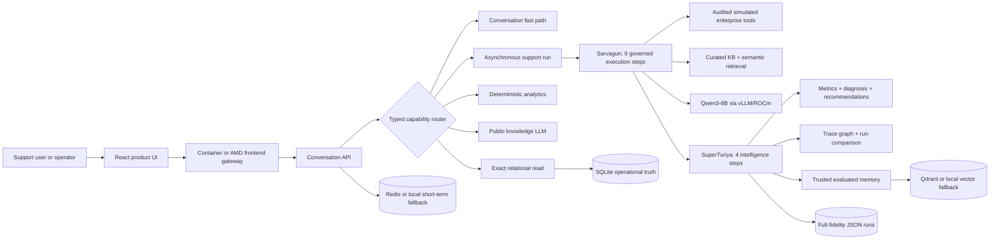

# Anirvium AI — Product 0.1

**Submission:** AMD Developer Hackathon: ACT II

**Track:** Track 3 — Unicorn Track

**Product:** Anirvium AI

**Execution system:** Sarvagun

**Trajectory-intelligence system:** SuperTuriya

**Document status:** submission source of truth

**Audit date:** 2026-07-13

**Audited implementation SHA:** `f1d518566ac08bbdd4cafdb34dcb2891ba5dfe7e`
**Final submission SHA:** unresolved until submission assets and this document are committed

## 1. Submission control block

### Official sources

- [AMD Developer Hackathon: ACT II](https://lablab.ai/ai-hackathons/amd-developer-hackathon-act-ii)
- [ACT II participant guide](https://drive.google.com/file/d/1UGpOZiGGGBqQhGQxX7g19QAA-Dq9hPKk/view?usp=sharing)
- [lablab.ai submission guidelines](https://lablab.ai/ai-articles/hackathon-guidelines)
- [AMD AI Developer Program](https://www.amd.com/en/developer/ai-dev-program.html)
- [ROCm documentation](https://rocm.docs.amd.com/)

### Track 3 contract

ACT II Track 3 is the **Unicorn Track**. It accepts any open-source models and frameworks used with AMD GPUs and/or Fireworks AI to build a product- or startup-oriented project. There is no fixed performance benchmark for this track.

Judges evaluate:

1. creativity and originality;
2. product/market potential;
3. completeness;
4. meaningful use of AMD platforms.

### Mandatory submission contract

The official event page requires:

- a project title, short description, long description, and technology/category tags;
- a cover image, video presentation, and slide presentation;
- a public GitHub repository;
- a demo application platform and application URL;
- a containerized submission;
- a public README with setup and usage instructions;
- an application that runs from the supplied instructions;
- an original, MIT-compliant submission.

The general lablab.ai guide currently specifies:

- project title: maximum 50 characters;
- short description: maximum 255 characters;
- long description: minimum 100 words;
- cover image: 16:9 recommended;
- video: maximum five minutes and under 300 MB.

### Current control status

| Item | Current status | Release decision |
| --- | --- | --- |
| Track | Track 3 — Unicorn Track | Ready |
| Team eligibility/registration | Must be confirmed by the registered team lead in lablab.ai | **Unresolved blocker** |
| Submission deadline | Must be checked in the live Event Schedule in the team’s timezone | **Unresolved blocker** |
| Public repository | `https://github.com/Anirvium/AMD_Anirvium` visibility was verified as public through GitHub metadata | Ready; recheck the final SHA |
| Containerization | Backend and frontend Dockerfiles, `docker-compose.yml`, and a CI container smoke job exist | Confirm the final Actions run |
| README/setup | Judge-first URL map, startup, health, log, API, and recovery instructions are present | Ready |
| Application URL | GitHub Pages target `https://anirvium.github.io/AMD_Anirvium/` is prepared | **Enable and externally verify after push** |
| Video | Narrated 4:08, 5.4 MB MP4 prepared at `docs/assets/Anirvium_AI_ACT_II_Video.mp4` | Upload/attach and verify playback |
| Slide presentation | Reviewed PowerPoint exists at `docs/assets/Anirvium_AI_ACT_II_Deck.pptx` | Upload/attach in the form |
| Cover image | Prepared at `docs/assets/anirvium-cover-16x9.png` | Upload in the form |
| MIT license | Valid root `LICENSE` is included in the release working tree | Ready after final push |
| AMD proof | Summarized evidence exists; raw logs and screenshots are not committed | Partial |

This document does not mark an unresolved item complete merely because implementation instructions exist.

## 2. Copy-ready submission fields

### Project title — 44 characters

> Anirvium AI: The Control Plane for AI Agents

### Short description — 179 characters

> An evidence-backed control plane for AI agents: Sarvagun resolves support cases on AMD-hosted Qwen while SuperTuriya traces failures, evaluates decisions, and guides future plans.

### Long description — 268 words

> AI support agents are entering payment, identity, refund, and escalation workflows, but most platforms show only a final answer. Support leaders cannot prove which evidence was used, which tool acted, whether policy was followed, or why the same failure returned.
>
> Anirvium AI is a trajectory-intelligence control plane for enterprise agents. Sarvagun is its governed customer-support system. It routes each request to the lowest-complexity correct path: conversation, exact customer or case data, analytics, public knowledge, or a full support workflow. SuperTuriya observes the workflow end to end. It captures agent and tool spans, evidence, approval states, safe decision summaries, latency, risk, and model provenance. It scores each run, diagnoses failures, compares trajectories, and stores evaluated lessons for future planning. Memory is advisory and never rewrites policy automatically.
>
> The live AMD path serves Qwen3-8B with vLLM and ROCm on AMD Developer Cloud. Qwen drafts responses and routed public-knowledge answers, while deterministic policy and compliance gates reject unsafe commitments and provide a safe fallback. The containerized product uses FastAPI and React, with SQLite operational truth, Redis short-term memory, Qdrant-compatible semantic memory, and ReactFlow trace visualization. All product data is synthetic and enterprise connectors are clearly simulated.
>
> Our demo starts with a customer's third unresolved withdrawal complaint. Sarvagun retrieves linked case history and governed evidence, detects recontact and escalation risk, and holds sensitive claims for approval. SuperTuriya reveals the thirteen-step execution, identifies failure points, and recommends measurable workflow fixes.
>
> The beachhead customer is a support or AI-operations leader deploying agents in regulated or SLA-sensitive workflows. Customer support is the first vertical; SuperTuriya can extend the same trajectory-intelligence pattern to other enterprise agents.

### Technology tags

Select only tags that are present in the lablab.ai submission UI and actually used:

- AMD Developer Cloud
- AMD ROCm
- vLLM
- Qwen / Qwen3-8B
- Docker
- Python
- FastAPI
- Pydantic
- React
- TypeScript
- Vite
- ReactFlow
- SQLite
- Redis
- Qdrant

Do not tag Fireworks AI, Gemma, NativelyAI, LangChain, CrewAI, AutoGen, Vision, or Multimodal AI unless those technologies become genuinely integrated before submission.

### Category tags

Recommended, subject to platform availability:

- Unicorn Track
- AI Agents
- AgentOps
- Customer Support
- Enterprise AI
- Business
- Web Application
- Utility and Tools
- Assistant
- Developer Tools

The current Qwen build can compete for the main Unicorn Track. It does not qualify for the separate **Best AMD-Hosted Gemma Project** prize without a meaningful AMD-hosted Gemma integration.

## 3. Thirty-second pitch

> AI support agents can sound confident while missing evidence, violating policy, or escalating the wrong case. Anirvium AI makes their complete decision path inspectable. Sarvagun resolves governed customer-support work on AMD-hosted Qwen. SuperTuriya traces every agent, tool, evidence source, risk, and approval gate; scores and diagnoses the run; compares execution paths; and recalls only evaluated lessons for future planning. We start with regulated and SLA-sensitive support teams, then extend the same trajectory-intelligence control plane to other enterprise agent systems.

## 4. Five-minute judge pitch and demo

### 0:00–0:30 — Problem and buyer

Say:

> Enterprises are deploying support agents into payment, verification, refund, and escalation workflows, but most tools show only the final answer. A Head of Support or AI Operations leader cannot prove why an agent acted, whether it used the right evidence, or how to prevent the same failure next time.

Show the Sarvagun workspace and the synthetic active queue.

### 0:30–1:00 — Product insight

Say:

> Anirvium has two planes. Sarvagun executes the support task. SuperTuriya is the trajectory-intelligence layer that observes, evaluates, diagnoses, compares, and remembers the execution. The innovation is not another chatbot response; it is a governed control plane for the full decision path.

Briefly switch between the **Sarvagun** and **SuperTuriya** tabs.

### 1:00–1:30 — Prove intelligent routing

Use two or three fast requests before the long run:

1. `List all customers`
2. `Show all payment-failure cases`
3. `What is a capital market?`

Explain that exact business records use a relational read, public knowledge uses the configured model, and personal support problems enter the governed agent workflow. In deterministic Docker mode, the public-knowledge path truthfully reports that no live model is configured.

### 1:30–2:40 — Run canonical case `CS-002`

Select `CS-002` and submit:

> This is my third contact. My withdrawal says processed, but the bank has not received it after five working days. The earlier tracking reference did not help, nobody replied to the promised update, and I am extremely frustrated.

While the asynchronous job runs, show actual progress through the execution rail. Explain:

- Priya Shah and `CS-C002` remain the selected identity;
- the issue is `withdrawal_processed_missing`;
- high priority, angry sentiment, prior contact, and SLA context are preserved;
- the system retrieves `POL-CS-PAY-002`, `PROC-CS-WDR-001`, and `TMPL-CS-WDR-002` when relevant;
- sensitive payment outcomes remain approval-controlled;
- enterprise tools are simulated and explicitly labeled.

Pre-warm the model before recording. Keep a completed `CS-002` run available so a temporary public proxy or model delay does not consume the demonstration.

### 2:40–3:35 — Inspect SuperTuriya

Open the SuperTuriya tab and click trace nodes. Show:

- the actual 13-step graph;
- safe decision summary, not hidden chain-of-thought;
- recorded output;
- latency and estimated tokens;
- active model label;
- tools and evidence IDs;
- risk flags and approval state;
- trajectory score and diagnosis;
- optimizer recommendation;
- recalled, applied, and created memory IDs.

State clearly that the first nine steps are Sarvagun execution and the final four are SuperTuriya intelligence.

### 3:35–4:15 — Demonstrate improvement without overclaiming

Say:

> SuperTuriya does not silently rewrite policy or deploy code. It stores only evaluated trajectory summaries and transcripts in the trusted memory scope. Future planning and drafting may retrieve those lessons, but current policy and exact operational state remain authoritative.

If two compatible completed runs are available, show `/runs/compare`. Otherwise show the comparison contract without improvising a result.

### 4:15–4:40 — Prove AMD use

Show the runtime model ID and AMD evidence summary. Say:

> The live path served Qwen3-8B as `anirvium-text` through vLLM and ROCm on the allocated AMD Developer Cloud GPU. Qwen performs customer-response drafting and routed public-knowledge generation. Policy, compliance, critic evaluation, embeddings, and reranking remain deterministic in this demo unless explicitly reported otherwise.

Do not spend the Track 3 pitch on benchmark optimization; benchmark evidence exists to prove meaningful AMD execution.

### 4:40–5:00 — Market and close

Say:

> Our beachhead customer is a support or AI-operations leader deploying agents in regulated or SLA-sensitive work. We reduce opaque automation risk and manual QA by making agent behavior inspectable, testable, and reusable. Customer support is the first vertical. The larger product is SuperTuriya: trajectory intelligence for any enterprise agent system.

## 5. Problem, user, and market hypothesis

### Problem

Agent deployments create a control gap:

- final responses hide the path that produced them;
- policy, evidence, and tool-use failures are discovered after customer impact;
- support QA remains transcript-heavy and manual;
- repeated failures are not converted into reusable execution intelligence;
- generic observability shows telemetry but not domain-specific correctness.

### Beachhead user

Primary user:

- Head of Support;
- Head of AI Operations;
- CX Automation leader;
- Support QA or governance lead.

Initial customer profile:

- fintech, B2B SaaS, infrastructure, cybersecurity, or other support organizations;
- agent-assisted payment, identity, refund, security, outage, or SLA workflows;
- meaningful cost from escalation, recontact, audit, churn, or unsupported commitments;
- existing ticketing/CRM and policy corpus that can be connected read-only first.

### Jobs to be done

1. Inspect why an agent selected a route, tool, policy, or response.
2. Prove whether a response was grounded and approval-safe.
3. Find repeated failure and latency patterns across trajectories.
4. Compare a baseline and candidate agent workflow.
5. Reuse evaluated lessons without allowing stale memory to override policy.
6. Give reviewers an operational handoff rather than an opaque error.

### Market hypothesis

The market hypothesis is that enterprises will add a trajectory-intelligence layer as agent systems move from low-risk chat into operational workflows. The initial wedge is customer-support governance because outcomes, escalations, evidence, approval, recontact, SLA, and customer satisfaction are measurable.

No total-addressable-market number, customer contract, or design-partner validation is claimed in Product 0.1. Those require external research and customer discovery.

### Pricing hypothesis — not validated

| Offer | Hypothesized price | Purpose |
| --- | ---: | --- |
| Design-partner pilot | USD 10,000–25,000 for 8–12 weeks | Connect one support workflow, define evaluation rubric, and prove trace/QA value |
| Team platform | USD 2,000–5,000 per month plus usage | One support organization, bounded traces, evaluation, and memory |
| Enterprise platform | USD 50,000–150,000 annual contract plus usage/integration | Tenant controls, connectors, reviewer workflow, retention, SSO, and support |

These ranges are a discovery hypothesis, not demonstrated willingness to pay. Validate them with at least 15 buyer interviews and two design partners.

### ROI hypothesis — not yet measured

Measure:

- manual QA minutes per reviewed conversation;
- recontact rate;
- unsupported-commitment rate;
- correct escalation and evidence rates;
- mean time to diagnose an agent failure;
- improvement from baseline to a memory-guided candidate;
- cost and latency per resolved case.

Product 0.1 does not claim a measured customer ROI.

## 6. Product architecture



### Typed request paths

| Capability | Execution path | Reason |
| --- | --- | --- |
| Greeting/transition | Conversation manager | Avoid unnecessary model/tool cost |
| Customer directory | Direct SQLite read | Exact records, filters, and counts |
| Payment-failure list | Direct SQLite read | Deterministic structured business query |
| Customer/case lookup | Direct SQLite read | Exact identity and relationship retrieval |
| Support analytics | Deterministic analytics | Reproducible aggregate over canonical rows |
| Public definition | Configured live text model | General knowledge without business-record leakage |
| Personal support issue | Sarvagun workflow | Evidence, policy, tool, escalation, approval, and evaluation required |

This routing is deliberate. Running 13 agents for “list all customers” would be agent theater, not intelligence.

## 7. Sarvagun and SuperTuriya lifecycle

### Sarvagun execution plane

1. Planner Agent
2. Attachment Evidence Agent
3. Intake / Triage Agent
4. Knowledge Retrieval Agent
5. Policy Checker Agent
6. Escalation Agent
7. Response Drafting Agent
8. Compliance Agent
9. Human Escalation Agent

### SuperTuriya intelligence plane

10. Critic / Evaluator Agent
11. Reflection Agent
12. Learning Extraction Agent
13. Optimizer Agent

### Closed, governed loop

```text
Sarvagun executes
→ SuperTuriya observes and traces
→ deterministic evaluation and diagnosis
→ concrete improvement recommendation
→ evaluated memory is stored
→ relevant trusted memory may be recalled
→ future plan/draft receives advisory guidance
→ current policy remains authoritative
```

### Hybrid execution truth

The support runner accepts `policy_driven`, `plan_driven`, `autonomous`, and `hybrid` modes. The autonomous scope is bounded by deterministic policy/compliance gates and a maximum 13-step workflow. The current implementation records a bounded two-decision autonomous trace; it is not an unbounded self-directing agent society.

The topology remains stable for governed support runs. Dynamic intelligence currently appears in capability routing, issue resolution, tool selection, escalation, approvals, response generation, memory recall, and quality gates—not in arbitrary topology generation.

## 8. Data, storage, and memory

### Relational operational truth

SQLite schema `sarvagun-operational-v1` stores exact operational facts with foreign keys and WAL mode:

- support queues;
- customers;
- support cases;
- accounts;
- transactions;
- verification records;
- approval requests;
- escalations;
- workflow states;
- evaluation cases;
- conversation sessions and turns;
- agent runs and evaluations;
- tool executions;
- explicit feedback.

The seed-level synthetic domain contains:

- 6 customers;
- 13 cases;
- 6 accounts;
- 5 transactions;
- 6 verification records;
- 6 approval requests;
- 5 escalations;
- 13 workflow-state rows;
- 10 internal evaluation cases.

Counts for conversations, runs, evaluations, tools, and feedback vary as tests and demos execute and are not submission-scale claims.

### Curated knowledge

The governed corpus contains 34 records:

- 8 policies;
- 8 procedures;
- 8 templates;
- 10 evaluation cases.

Evaluation-only records are excluded from generation-safe answer evidence.

### Vector collections

These are Qdrant **collections**, not three clusters:

| Collection | Owner | Purpose |
| --- | --- | --- |
| `anirvium_sarvagun_kb` | Sarvagun | Semantic discovery over curated policies, procedures, templates, and evidence |
| `anirvium_superturiya_memory` | SuperTuriya | Trusted long-term evaluated summaries and transcript memory |
| `anirvium_superturiya_trajectories` | SuperTuriya | Whole-run trajectory documents for similarity recall |

The active embedding is a deterministic 64-dimensional signed token hash. `Qwen/Qwen3-Embedding-4B` is configured but inactive. Active reranking is deterministic lexical/vector rank fusion. `Qwen/Qwen3-Reranker-4B` is configured but inactive.

Qdrant is used when `VECTOR_BACKEND=qdrant`; otherwise a process-local vector adapter is used. Failures can fall back locally and must remain visible in `/platform/status`.

### Redis and short-term memory

When `MEMORY_BACKEND=redis`, recent session records use the namespace `anirvium:sarvagun:session:*`, a bounded list, and a default 3,600-second TTL. Local fallback exists. Mid-term summaries remain process-local in Product 0.1.

### Full-fidelity trajectory storage

Completed runs are persisted as JSON for audit and replay. SQLite indexes structured run/evaluation/tool facts. A generated property graph supports trace exploration; Neo4j is not an active requirement or claimed deployment.

### Storage rule

> Relational storage decides what is true. Redis accelerates what is current. Vector storage finds what is semantically relevant. The trajectory store preserves what happened.

## 9. Canonical demonstration: `CS-002`

### Case

| Field | Value |
| --- | --- |
| Ticket | `CS-002` |
| Customer | Priya Shah |
| Customer ID | `CS-C002` |
| Plan | Pro |
| Issue | `withdrawal_processed_missing` |
| Priority | High |
| Sentiment | Angry |
| Attachment | `bank-response-redacted.pdf` metadata; deterministic text-first handling |
| Expected governed evidence | `POL-CS-PAY-002`, `PROC-CS-WDR-001`, `TMPL-CS-WDR-002` |

### Canonical prompt

> This is my third contact. My withdrawal says processed, but the bank has not received it after five working days. The earlier tracking reference did not help, nobody replied to the promised update, and I am extremely frustrated.

### Expected behavior to verify live

1. Selected identity remains `CS-C002` / Priya Shah.
2. Issue resolution remains withdrawal processed but missing.
3. Emotion and repeat-contact signals are visible.
4. Relevant withdrawal/payment evidence is retrieved; `EVAL-*` records do not enter the answer evidence.
5. Simulated customer-system reads and operational-status checks are clearly labeled.
6. Finance/escalation ownership is selected according to current policy and evidence.
7. No unsupported promise of withdrawal completion, refund, unblocking, or compensation is made.
8. Approval-sensitive output remains a draft or human-review state.
9. The run produces 13 trace spans.
10. SuperTuriya exposes metrics, diagnosis, recommendation, and memory IDs.
11. `/runs/compare` can compare two persisted, compatible runs without overriding safety regressions.

The curated incident scenario is designed to demonstrate the sixth-unique-customer threshold. Verify the actual live run before narrating that incident as triggered; do not read an expected script as runtime evidence.

## 10. AMD implementation and evidence

### Proven path

The supplied AMD session evidence records:

- AMD Developer Cloud runtime;
- one visible AMD GPU;
- approximately 47.98 GiB visible VRAM;
- GFX target `gfx1100`;
- ROCm driver `6.16.13`;
- vLLM `0.16.1.dev0+g89a77b108.d20260318`;
- Qwen3-8B served as `anirvium-text` through an OpenAI-compatible endpoint;
- successful model smoke request;
- a live 13-step application run with no raw `<think>` leakage;
- summarized trajectory benchmark results.

### Observed benchmark summary

The committed summary in `amd/benchmark_results_real.md` records an observed six-ticket, three-repeat run with:

- average model throughput: 72.53 tokens/second;
- average full-run latency: approximately 190.18 seconds;
- 13 agent steps;
- average internal trajectory score: 70.9;
- deterministic policy compliance: 1.0;
- deterministic evidence grounding: 1.0.

These are observed hackathon measurements, not a Track 3 ranking metric, production SLA, independent benchmark, or statistically general result.

### Exact model roles

| Role | Current active implementation |
| --- | --- |
| Sarvagun response drafting | Qwen3-8B via `anirvium-text` when live AMD provider is configured; deterministic safe fallback otherwise |
| Routed public knowledge | Same live text client; mock mode degrades truthfully |
| Planner, routing, policy, compliance | Deterministic application logic |
| SuperTuriya critic/evaluator | Deterministic trajectory evaluator by default |
| Embedding | Deterministic token-hash 64d |
| Reranking | Deterministic hybrid rank fusion |
| Visual evidence | Deterministic attachment-aware text-first extraction |

### Claim boundary

The evidence proves that the text-first generation path ran on an AMD Developer Cloud GPU through vLLM/ROCm. It does not prove:

- MI300X 192GB execution;
- real vision/video inference;
- GPU embedding or reranker execution;
- a separate active critic model;
- all 13 steps being LLM calls;
- real customer or enterprise-system writes;
- production latency, availability, or scale.

Raw AMD benchmark JSON and runtime screenshots are not currently committed. Do not call the repository evidence independently reproducible until sanitized raw artifacts or hashes are attached.

## 11. Creativity and differentiation

### Product insight

Most AI support products optimize the answer. Most observability products record model calls. Anirvium connects execution and intelligence:

```text
domain-governed action
→ trace-level evaluation
→ failure diagnosis
→ path comparison
→ trusted experience recall
```

### Category comparison

| Alternative | What it typically provides | Anirvium 0.1 distinction |
| --- | --- | --- |
| Generic support chatbot | Conversation and final answer | Governed tools, evidence, approval, escalation, and complete trace |
| LLM tracing platform | Prompts, responses, tokens, latency | Domain-specific correctness, policy state, business evidence, diagnosis, and safe handoff |
| Offline evaluation framework | Batch scores and test cases | Evaluation connected to the live trajectory, UI, memory, and run comparison |
| Workflow automation | Deterministic task execution | Combined execution plane and post-execution intelligence plane |
| Manual support QA | Human transcript review | Structured, repeatable trace inspection and failure taxonomy |

### Defensible design decisions

- Direct typed capabilities avoid unnecessary multi-agent execution.
- Public decision summaries provide accountability without exposing hidden chain-of-thought.
- Memory is trusted only after evaluation and cannot override current policy.
- Sensitive outputs remain draft/review states.
- Active/fallback models and storage backends are disclosed at runtime.
- The trajectory comparison verdict lets safety regression override a higher aggregate score.

No proprietary dataset, patent, customer-exclusive connector, or validated data moat is claimed yet.

## 12. Evaluation and technical proof

### Internal trajectory metrics

The deterministic evaluator reports:

- task completion;
- evidence grounding;
- policy compliance;
- hallucination risk;
- escalation quality;
- actionability;
- missing information;
- customer tone;
- token efficiency;
- latency efficiency;
- overall score.

Lower raw values are better for hallucination risk and missing information. The overall score inverts those risk metrics.

### Current verification

At the audited SHA:

- backend: **95 tests passed** locally;
- frontend: TypeScript and Vite production build passed;
- frontend bundle: 1,746 modules transformed;
- SQLite foreign-key check: zero violations in the audited local store;
- CI workflow exists for backend compilation/tests and frontend install/build.

CI status, public-repository access, container startup, and browser interactivity still require final submission-SHA evidence.

### External benchmark truth

No official τ-bench, τ²-bench, or τ³-bench result exists. `sarvagun-curated-eval-v1` is an internal synthetic suite and must not be presented as an external score.

### Next credible product experiment

Freeze a held-out case set and compare:

1. plain text model;
2. model plus current evidence/policy path;
3. full Sarvagun execution without recalled memory;
4. full system with trusted SuperTuriya recall.

Measure exact evidence, policy, escalation, unsupported-claim, latency, token, recontact, and human-review outcomes. This would turn the improvement thesis into controlled evidence.

## 13. Safety, governance, and privacy

### Implemented prototype controls

- synthetic-only customer and operational data;
- tool allowlist, read/write classification, timeout, idempotency key, status, and audit ID;
- simulated connector labels;
- approval and human-review states for sensitive output;
- deterministic policy and compliance gates;
- generation-safe evidence filtering;
- unsafe/empty/failed LLM output falls back to a deterministic safe response;
- private `<think>` blocks are stripped from public output;
- trusted-memory scope prevents arbitrary memory from influencing future runs;
- automatic policy mutation is disabled;
- predicted satisfaction remains separate from explicit customer feedback;
- correlation IDs connect request, job, run, agent, model, and lifecycle logs.

### Production security gaps

- no authentication or production RBAC;
- no tenant isolation;
- no real reviewer identity or approve/reject operation;
- no production PII redaction/retention pipeline;
- no immutable audit store;
- no rate limit, abuse control, or production circuit breaker;
- no central OpenTelemetry exporter or error-monitoring platform;
- no prompt-injection and tool-output-injection security suite;
- no formal SBOM, dependency audit, disaster recovery, or production SLO.

Anirvium 0.1 demonstrates governance controls. It is not certified compliant, enterprise-secure, or production-hardened.

## 14. Current limitations

1. Enterprise connectors are simulated.
2. All demo customer/business data is synthetic.
3. The support topology is fixed at 13 steps even though routing and decisions are contextual.
4. The async job manager is a single-worker in-process executor, not a durable distributed queue.
5. Progress uses HTTP polling rather than SSE/WebSocket streaming.
6. SQLite is suitable for a single-instance demo, not a multi-tenant production service.
7. Redis and Qdrant can fall back locally; the active backend must be checked at runtime.
8. Mid-term memory is process-local.
9. Embeddings and reranking are deterministic substitutes.
10. SuperTuriya recommends changes and recalls evaluated memory; it does not apply or deploy workflow changes automatically.
11. Human review is a held state, not a complete authenticated review inbox.
12. The property graph is generated locally; Neo4j is not active.
13. Direct capabilities do not generate the same 13-step trace as governed support runs.
14. General knowledge has no web search or live citations.
15. Frontend browser E2E tests are absent.
16. The GitHub Pages resilience URL must still be enabled and externally verified after the final push.
17. The narrated video and reviewed PowerPoint are prepared but still must be uploaded or attached in the submission form.
18. Raw AMD logs/screenshots are absent from the repository.
19. No customer validation or measured ROI exists.
20. The repository has an MIT license, but third-party models, packages, and the team-supplied anonymized reference corpus retain their own applicable terms.

## 15. Roadmap

### Submission release — immediate

Repository work completed for the release candidate:

1. Added the MIT license and explicit data/model claim boundaries.
2. Prepared the 16:9 cover and two clearly labelled product presentation renders.
3. Produced and visually verified the ten-slide PowerPoint aligned to the current 13-step `CS-002` story.
4. Added a static GitHub Pages resilience build and a complete Docker reproduction path.
5. Re-ran all 95 backend tests plus normal and static frontend production builds.
6. Removed stale seven-agent, `T-001`, pending-AMD, and outdated test-count claims from primary judge materials.

Manual platform actions still required:

1. Upload or attach `docs/assets/Anirvium_AI_ACT_II_Video.mp4` and verify playback.
2. Upload or attach `docs/assets/Anirvium_AI_ACT_II_Deck.pptx` and verify public access if a URL is required.
3. Enable/verify GitHub Pages and test the application URL without team authentication.
4. Verify the final public GitHub SHA and green Actions checks.
5. Confirm redistribution rights for the team-supplied anonymized reference corpus.
6. Complete the lablab.ai form and save the submission confirmation.

### Product validation — next 30 days

1. Interview 15 target buyers and recruit two read-only design partners.
2. Add one real read-only CRM/ticketing adapter behind the connector interface.
3. Freeze a 50-case evaluation suite and run baseline/ablation experiments.
4. Add an authenticated reviewer inbox with approve/reject/resume.
5. Add browser E2E and accessibility tests.
6. Add structured JSON logs, OTel export, metrics, and error monitoring.
7. Persist job state and implement cancellation/SSE progress.

### Productization — next 90 days

1. Move operational truth to PostgreSQL with migrations and tenant isolation.
2. Activate and measure a real embedding model and learned reranker.
3. Build trajectory-population mining for recurring failure paths and bottlenecks.
4. Add versioned model, prompt, policy, and configuration registries.
5. Build a governed propose → test → approve → promote improvement workflow.
6. Add retention, redaction, encryption, immutable audit, and incident-response controls.
7. Generalize SuperTuriya’s ingestion contract to a second agent system beyond support.

## 16. Submission asset matrix

| Asset | Required by ACT II | Repository/status | Owner action |
| --- | --- | --- | --- |
| Project title | Yes | Copy-ready in this document; 44/50 characters | Paste exactly |
| Short description | Yes | Copy-ready; 179/255 characters | Paste exactly |
| Long description | Yes | Copy-ready; 268 words and 1,976 characters | Paste exactly |
| Technology/category tags | Yes | Recommended list present | Select only actual available tags |
| Cover image | Yes | Prepared at `docs/assets/anirvium-cover-16x9.png`, 1672×941 | Upload to the form |
| Video presentation | Yes | Narrated 4:08, 5.4 MB MP4 prepared | Upload/attach and verify playback |
| Slide presentation | Yes | Reviewed ten-slide deck at `docs/assets/Anirvium_AI_ACT_II_Deck.pptx`; overflow QA passed | Attach/upload and verify access |
| Public GitHub | Yes | Repository metadata verified public | Recheck final SHA without authentication |
| Demo platform | Yes | Static GitHub Pages workflow, Docker, and AMD gateway paths exist | Verify Pages and select it in the form |
| Application URL | Yes | Pages target prepared; external verification pending | Enable/verify target URL in incognito |
| Container | Yes | Dockerfiles, Compose, and CI container smoke job present | Confirm the final GitHub Actions run |
| README/setup | Yes | Judge-first URL map, commands, health checks, logs, and recovery path present | Final link check |
| MIT license | Event compliance | Root `LICENSE` prepared | Include in final commit |
| AMD proof | Track criterion | Summary present; raw logs/screenshots unresolved | Attach sanitized evidence or hashes |
| Backend verification | Completeness evidence | 95 local tests passed on the release working tree | Confirm final CI |
| Frontend verification | Completeness evidence | Normal and static production builds passed | Browser-test final Pages URL |
| Canonical demo | Completeness evidence | `CS-002` defined here | Use in UI, video, deck, README, and narration |
| Claim boundary | Credibility | Defined here and in platform API | Preserve verbatim in final review |

## 17. Track 3 criterion-to-evidence matrix

| Judge criterion | Strongest current evidence | Remaining gap | Final presentation emphasis |
| --- | --- | --- | --- |
| Creativity and originality | Two-plane Sarvagun/SuperTuriya design; typed cost-aware routing; trace evaluation; trusted memory; safety-aware comparison | No named competitive analysis or generalized second integration | Show why this is a trajectory control plane, not chatbot or generic trace viewer |
| Product/market potential | Clear support/AI-operations buyer; regulated/SLA-sensitive wedge; reusable intelligence thesis | No interviews, design partners, pricing validation, or measured ROI | State beachhead, workflow pain, pricing hypothesis, and validation plan honestly |
| Completeness | Working React/FastAPI product, 13-step run, data APIs, graph, evaluation, memory, Docker, 95 tests, reviewed deck, and static resilience build | Verified app URL, video, final CI, and real connectors | Demonstrate one coherent `CS-002` journey end to end |
| Use of AMD platforms | Qwen3-8B served through vLLM/ROCm on AMD Developer Cloud with summarized measured evidence | Raw evidence absent; Docker defaults to mock; only generation role is live | Show model ID/runtime, exact Qwen role, and AMD proof without implying all steps are model calls |

## 18. Final release rule

The submission is ready only when all of the following are true:

```text
public repository
+ MIT license
+ clean container run
+ stable public application URL
+ cover uploaded
+ video uploaded and playable
+ slide presentation uploaded
+ final SHA tests green
+ CS-002 walkthrough verified
+ AMD claim evidence attached
+ no stale or contradictory judge-facing claims
```

Until the application URL and prepared media uploads are verified, Anirvium AI is a strong product implementation with an incomplete ACT II submission package.
