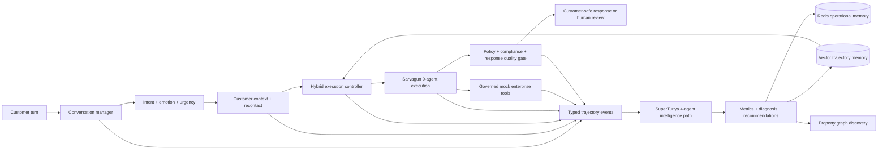

# Sarvagun and SuperTuriya Architecture

## Product identity

Anirvium AI is the umbrella platform.

- **Sarvagun** is the complete customer-support agentic execution system.
- **SuperTuriya** is the trajectory-intelligence system at its core. It observes Sarvagun, evaluates every run, discovers successes and failures, stores reusable intelligence, and influences future plans without mutating safety policy.
- The existing 13 agent names and their order remain stable for trace compatibility.

The closed loop is:

```text
Sarvagun executes
  → SuperTuriya observes and traces
  → SuperTuriya evaluates and discovers
  → reusable intelligence is stored
  → relevant intelligence is recalled before the next plan
  → Sarvagun applies the accepted guidance under current policy
```

## End-to-end lifecycle



### Sarvagun execution path

The unchanged agent chain is:

1. Planner Agent
2. Attachment Evidence Agent
3. Intake / Triage Agent
4. Knowledge Retrieval Agent
5. Policy Checker Agent
6. Escalation Agent
7. Response Drafting Agent
8. Compliance Agent
9. Human Escalation Agent

The Sarvagun lifecycle surrounds this chain with conversation state, customer context, emotion, recontact, incident detection, audited connectors, assurance control, provenance, response quality gating, satisfaction prediction, and transcript generation.

### SuperTuriya intelligence path

The existing intelligence agents remain:

10. Critic / Evaluator Agent
11. Reflection Agent
12. Learning Extraction Agent
13. Optimizer Agent

SuperTuriya also subscribes to typed lifecycle events, builds the discovered execution path, records evaluation successes and failures, stores trusted trajectory artifacts, and exposes the exact recalled, applied, and created memory IDs.

## Governed hybrid execution

The API accepts `execution_mode`:

| Mode | Decision authority | Behaviour |
|---|---|---|
| `policy_driven` | Deterministic workflow | Uses the fixed policy workflow and allowlisted context/tool operations. |
| `plan_driven` | Planner executable contract | Adds the Planner Agent’s required evidence, tools, stop conditions, and governed sequence. |
| `autonomous` | Bounded Sarvagun controller | Runs a maximum two-iteration decide–act–observe cycle over allowlisted actions. |
| `hybrid` | Risk-aware bounded autonomy | Uses autonomous selection inside deterministic policy, compliance, approval, and step limits. |

Every mode preserves the same non-bypassable controls:

- deterministic policy and compliance gates;
- enterprise-tool allowlist;
- role and approval checks;
- idempotent writes and audit IDs;
- maximum 13 agent steps;
- one replan limit;
- human handoff for approval-required or low-confidence work;
- no automatic policy mutation.

The autonomous trace records each observation, decision, selected tool, executed tool ID, observed status, policy-supervisor result, and termination reason. It cannot invoke an operation outside the allowlist.

## Customer-experience operations

Sarvagun now models:

- conversation signals and ordered turns;
- customer context and open cases;
- emotion, irritation, acknowledgement, apology, and escalation risk;
- same-customer/same-issue recontact over 24-hour, 7-day, 14-day, and 30-day windows;
- previous missed commitments;
- deterministic escalation state and SLA;
- audited mock CRM/customer-system executions;
- assurance type, supporting evidence, owner, and fulfilment state;
- emerging incidents using more than five unique customers in 60 minutes;
- customer and auditor provenance views;
- explicit CSAT kept separate from AI-predicted satisfaction;
- redacted synthetic transcripts and CRM transcript attachment;
- an operational CX snapshot API.

The deterministic demo fixture makes `CS-002` Priya Shah’s third unresolved withdrawal contact. Five prior unique customers have the same issue fingerprint; Priya is the sixth, so the incident rule produces one high-severity incident-manager escalation.

## Response quality and safety

The existing Response Drafting Agent creates an AMD-vLLM response when the configured model is available and uses a deterministic safe fallback otherwise. SuperTuriya then applies a deterministic quality gate after the Compliance Agent.

The gate checks:

- evidence grounding;
- completed compliance evaluation;
- absence of unsupported outcome guarantees;
- absence of private reasoning or hidden prompts;
- emotion acknowledgement;
- assurance support;
- proof that any claimed escalation write succeeded;
- response concision.

It records `approved`, `rewritten`, or `human_review_required`. Approval-required financial, identity, security, and policy-exception actions remain drafts even when response quality passes.

## Connector boundary

`CustomerSystemConnector` defines customer lookup, case history, case writes, notes, transcript attachment, and escalation creation. The hackathon runtime uses `MockConnector` with synthetic data.

Every execution records:

- tool execution and audit IDs;
- operation and read/write classification;
- authorization state and acting role;
- idempotency key and attempt;
- timeout and latency;
- approval requirement;
- before and after state;
- result, failure, and simulation status.

This proves the integration contract without claiming a real Salesforce, Slack, Citrix, payment, or internal-CRM connection.

## SuperTuriya memory loop

### Operational memory

Redis stores short-lived conversation and execution memory under:

```text
anirvium:sarvagun:session:*
```

The implementation supports Redis authentication, database selection, list reads, bounded retention, and TTL. If Redis is not configured or reachable, the status API reports the local in-process fallback.

### Long-term semantic memory

The vector layer stores:

- evaluated trajectory summaries;
- Sarvagun strategy, recontact, incident, and satisfaction context;
- SuperTuriya successes, failures, and recommendations;
- redacted synthetic transcript intelligence.

Only artifacts carrying `trust_scope=superturiya_evaluated_memory` can influence pre-plan execution. Manually posted long-term text is marked `manual_untrusted` and cannot enter the planning prompt. Qdrant is used when configured and reachable; otherwise the vector status explicitly reports the deterministic local fallback.

On a later similar run, the execution strategy records the recalled memory IDs and the concrete plan decisions they influenced. Current policy is always revalidated and cannot be overridden by memory.

## Observability and graph discovery

Typed events include:

```text
conversation.started
message.received
emotion.detected
recontact.detected
memory.recalled
plan.created
source.retrieved
tool.called
tool.completed
policy.checked
assurance.created
escalation.created
response.quality_checked
compliance.checked
response.ready_for_review
conversation.closed
transcript.generated
```

The property graph adds Customer, Conversation, ToolExecution, Transcript, Escalation, IncidentCluster, SuperTuriya, and IntelligenceMemory nodes to the existing Run, Span, Evidence, Risk, Diagnosis, and Action graph.

## API surface

Core endpoints:

```text
POST /conversations/turn
GET  /conversations/{conversation_id}
POST /runs/async
GET  /runs/jobs/{job_id}
GET  /runs/{run_id}
GET  /runs/{run_id}/trajectory/graph-discovery
GET  /cx/operations
GET  /cx/transcripts/{run_id}
POST /cx/feedback
GET  /memory/status
GET  /kb/vector/status
```

## Honest hackathon boundary

Implemented and demonstrable now:

- synthetic end-to-end customer-support execution;
- backend conversation classification and session turns;
- governed policy, plan, autonomous, and hybrid modes;
- AMD-vLLM response drafting with a deterministic safe fallback;
- mock enterprise connectors with audited executions;
- CX signals, incident detection, escalation, provenance, transcript, and satisfaction;
- structured SuperTuriya events, evaluation, graph discovery, and closed memory loop;
- recoverable asynchronous jobs and agent-level live progress;
- React production UI served behind the AMD Jupyter base path.

Not represented as production-complete:

- real Salesforce, Slack, Citrix, ticketing, or payment-system adapters;
- multi-worker durable job orchestration;
- token-by-token streaming (the UI currently polls real server-side agent progress);
- production identity, tenant isolation, and authorization;
- automatic safety-policy mutation;
- distributed incident clustering or production SLA monitoring;
- Neo4j persistence (the demo exports a local property graph and sample Cypher).

These boundaries are intentional: the demo proves the product architecture and intelligence loop without disguising synthetic integrations as production systems.
