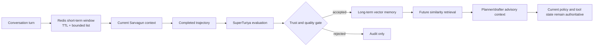

# τ-Bench Research and Storage Strategy

**Date:** 2026-07-12
**Applies to:** Anirvium AI, Sarvagun, and SuperTuriya

## Direct answers

### Have we used τ-bench, τ²-bench, or τ³-bench?

**No.** The repository currently has:

- no τ package or source dependency;
- no τ domain/task files;
- no `HalfDuplexAgent` or `FullDuplexAgent` adapter;
- no Sierra simulation trajectory;
- no `pass^1` or `pass^k` result;
- no leaderboard submission artifact;
- no pinned benchmark commit or reproducible benchmark command.

The only current τ references are explicit status fields and tests that say the benchmarks are unused and the official score is `null`.

The current `sarvagun-curated-eval-v1` suite is an **internal synthetic evaluation suite**. It is useful for regression testing, but it is not τ-bench, is not τ²/τ³-compatible evidence by itself, and must not be presented as an official or comparable τ score.

### Do we need a relational database?

**Yes.** Customer profiles, account ownership, cases, transactions, status, queues, approvals, assignments, and audit relationships require exact identity, joins, constraints, atomic updates, and deterministic filters. A vector database cannot safely answer “all open payment failures for customer X” or serve as the canonical record of a financial/support state change.

SQLite is appropriate for the current single-instance synthetic demo. Managed PostgreSQL is the recommended production target once multi-user concurrency, tenant isolation, backups, migrations, row-level security, and real connector synchronization are required.

### How is the vector database helping?

It provides approximate semantic retrieval for three different information classes:

1. governed knowledge used by Sarvagun;
2. evaluated long-term memories created by SuperTuriya;
3. whole-run trajectory documents used for experience recall.

It is **not** the source of truth for customers, accounts, cases, transactions, approvals, or workflow status. The current embedding and reranking implementations are deterministic local substitutes, not active Qwen embedding/reranking models.

## Primary-source research

### Original τ-bench

The original [τ-bench paper](https://arxiv.org/abs/2406.12045) evaluates a language agent interacting with a simulated user while following domain policy and using domain API tools. Its key evaluation compares the database state after the conversation with an annotated goal state. It introduced `pass^k` to measure reliability over repeated trials, not merely one lucky run.

Relevance to Sarvagun:

- state correctness matters more than a fluent response;
- policy adherence and tool execution must be evaluated together;
- repeated-trial reliability is a better claim than a single successful demo;
- exact environment state should remain external to the model.

### τ²-bench

The [τ²-bench paper](https://arxiv.org/abs/2506.07982) adds dual control: both the user and agent may use tools and change a shared environment. It models the problem as a decentralized partially observable process, introduces compositional task generation, and separates reasoning failures from communication/coordination failures.

Relevance to Sarvagun:

- support users often must perform steps such as checking a bank statement, changing a setting, or confirming identity;
- future evaluations should test whether Sarvagun guides the user correctly, not just whether Sarvagun calls its own tools;
- customer action, agent action, and shared state should be represented separately in the trace.

### Current τ³-bench release

The official Sierra repository remains named [`sierra-research/tau2-bench`](https://github.com/sierra-research/tau2-bench), but its current release is branded **τ³-bench**. The official repository documents:

- text half-duplex and voice full-duplex evaluation;
- `mock`, `airline`, `retail`, `telecom`, and `banking_knowledge` domains;
- policies, agent tools, tasks, and optional user tools per domain;
- a `base` task split for standard evaluation;
- Python `>=3.12,<3.14` and `uv` installation in the current release;
- configurable retrieval in the banking-knowledge domain;
- trajectory viewing, re-evaluation, and review commands.

The [official CLI guide](https://github.com/sierra-research/tau2-bench/blob/main/docs/cli-reference.md) exposes task IDs, trials, seeds, maximum steps/errors, concurrency, trajectory evaluation, and multiple retrieval configurations. The [official leaderboard guide](https://github.com/sierra-research/tau2-bench/blob/main/docs/leaderboard-submission.md) requires complete, consistently configured evaluations for verified claims and strongly prefers at least four trials per domain.

### τ-Knowledge

The [τ-Knowledge paper](https://arxiv.org/abs/2603.04370) adds knowledge-intensive conversational evaluation in a banking domain. It combines roughly 700 interconnected unstructured documents with tool-mediated state changes. The paper reports that even frontier systems struggle, which is precisely why a small curated KB and a successful demo run cannot be treated as external proof of retrieval robustness.

The current τ³ release describes 698 banking documents and 97 banking tasks. Sarvagun currently has 34 curated records and 10 internal evaluation cases. The product therefore has the right architectural ingredients for a knowledge-intensive benchmark, but nowhere near equivalent evaluation coverage.

## Honest current benchmark status

| Evidence | Current state | Official τ evidence? |
| --- | --- | --- |
| Internal 11-metric evaluation | Implemented | No |
| 10 curated support evaluation cases | Implemented | No |
| 95 backend tests | Passing locally at audit time | No |
| Persisted Sarvagun trajectories | Implemented | No |
| Deterministic run comparison | Implemented | No |
| Sierra benchmark environment | Absent | No |
| Standard τ tasks and policies | Absent | No |
| τ user simulator | Absent | No |
| State-goal evaluator | Absent | No |
| Repeated official trials / `pass^k` | Absent | No |
| Leaderboard artifact | Absent | No |

No internal score should be converted, normalized, or described as a proxy τ score. The task definitions and reward semantics are different.

## Recommended τ³ adoption plan

### Phase 0 — protect claim integrity

1. Keep `/platform/status` explicit: all τ `used` values false and scores null.
2. Label all existing evaluation output `internal_synthetic_evaluation_only`.
3. Never put “τ-compatible” on a score until a documented adapter and official environment have produced it.

### Phase 1 — create an isolated benchmark environment

Use a sibling checkout or a dedicated `benchmarks/tau3/` integration workspace rather than adding the full benchmark to the application runtime.

Requirements:

- pin an official τ³ commit or release tag;
- use Python 3.12 in a separate `uv` environment;
- record the benchmark commit, Sarvagun commit, model ID, vLLM arguments, prompt/configuration, retrieval config, seed, trial count, and AMD hardware/runtime;
- keep benchmark task data out of production memory and the application KB;
- disable cross-task and cross-trial SuperTuriya recall unless the benchmark protocol explicitly permits it.

This separation prevents dependency conflicts and, more importantly, evaluation contamination.

### Phase 2 — implement a real agent adapter

The official contribution guidance requires custom core agents to implement the relevant `HalfDuplexAgent` or `FullDuplexAgent` interface and register them in the benchmark. Start with text half-duplex.

The adapter should:

1. receive the official conversation and environment context;
2. make the benchmark policy available to Sarvagun without rewriting it;
3. expose only the benchmark-provided tools;
4. translate Sarvagun tool requests into official environment calls;
5. return either a customer-facing message or an official tool call;
6. preserve benchmark state as the sole source of truth;
7. emit a sidecar Anirvium trajectory keyed to benchmark task/trial, without changing the official trajectory;
8. prevent deterministic demo fixtures and mock connector state from participating.

Sarvagun’s current internal 13-agent result object cannot simply be submitted as a τ trajectory. The benchmark owns turn orchestration, tool schemas, user simulation, and reward evaluation.

### Phase 3 — smoke validation

Run, in order:

1. official `mock` domain for adapter correctness;
2. a small `banking_knowledge` subset for retrieval/tool integration;
3. a small `telecom` subset for dual-control behavior;
4. failure inspection with `tau2 view` and trajectory re-evaluation;
5. repeated trials to ensure deterministic IDs, state isolation, and no memory leakage.

Small subsets are engineering smoke tests only. They are not leaderboard claims.

### Phase 4 — full evaluation

For a credible reported result:

- use the standard `base` split;
- run all tasks in each reported domain;
- use identical agent and user-simulator configurations across domains;
- run at least four trials where feasible, following current leaderboard guidance;
- retain official trajectory files;
- report `pass^1` and the available `pass^k` values with confidence intervals or repeated-trial context;
- disclose custom routing, retrieval, prompts, memory, and SuperTuriya behavior;
- report failures, not just aggregate success.

Only after this phase can `/platform/status` truthfully report a used benchmark and a result artifact.

### Phase 5 — use SuperTuriya without corrupting the benchmark

SuperTuriya should ingest completed official trajectories **after** official scoring. It can then:

- map benchmark messages and tool calls into the Anirvium property graph;
- classify failure stage: routing, retrieval, policy reasoning, tool argument, user guidance, state transition, or final communication;
- compare successful and failed paths;
- propose changes for a new frozen candidate version;
- evaluate the candidate in a new clean benchmark run.

It must not retrieve hidden task solutions, prior test-trial outcomes, or evaluator annotations during the same official evaluation. Improvement must occur between versioned experiments, not by leaking evaluation state into the agent.

## Storage architecture: source-of-truth contract

| Data class | Correct store | Reason |
| --- | --- | --- |
| Customer/profile/account identity | Relational database | Exact keys, constraints, joins, tenant security, updates |
| Cases, status, queue, ownership, SLA | Relational database | Deterministic filters and transactional workflow state |
| Transactions, deposits, withdrawals, refunds | Relational/ledger system | Auditable state transitions; vector similarity is unsafe |
| Approvals and reviewer decisions | Relational append-only/audit model | Authorization and non-repudiation |
| Current conversation window | Redis with TTL | Low-latency ephemeral context |
| Job leases, locks, rate limits, idempotency cache | Redis or durable queue backend | Fast coordination; not canonical business state |
| Policy/procedure/template text | Document/object source + vector index | Versioned source plus semantic discovery |
| Evaluated long-term lessons | Vector database plus metadata/audit record | Similarity recall across future runs |
| Full trajectory and transcript | Durable object/JSON store; relational index | Full-fidelity audit and replay |
| Trace relationships | Generated property graph; graph DB only if query value justifies it | Path discovery and relationship analysis |
| Metrics/time series | Metrics backend | Aggregation, alerting, retention |

The design rule is simple:

> Relational storage decides what is true. Redis accelerates what is current. Vector storage finds what is semantically relevant. The trajectory store preserves what happened.

## Current relational implementation

The application now uses SQLite schema `sarvagun-operational-v1` with:

- `schema_metadata`;
- `support_queues`;
- `customers`;
- `support_cases`;
- `accounts`;
- `transactions`;
- `verification_records`;
- `approval_requests`;
- `escalations`;
- `workflow_states`;
- `evaluation_cases`;
- `conversation_sessions`;
- `conversation_turns`;
- `agent_runs`;
- `evaluations`;
- `tool_executions`;
- `explicit_feedback`.

Foreign keys and WAL mode are enabled. The coherent seed contains 6 customers, 13 cases, 6 accounts, 5 transactions, 6 verification records, 6 approval requests, 5 escalations, and 13 workflow states; `PRAGMA foreign_key_check` reports zero violations. The repository provides exact filters and joins plus completed run, evaluation, tool, conversation, and feedback persistence.

The operational tables are currently deterministic synthetic snapshots. Runtime mock-tool executions are audited, but they do not yet transactionally update every transaction, verification, approval, escalation, and workflow row. That state-transition integration is required before any production claim.

### Why SQLite is enough now

- one AMD notebook process;
- synthetic data;
- low concurrency;
- no production tenant boundary;
- straightforward backup/reset for a demo.

### When to move to PostgreSQL

Move before real customer deployment or horizontally scaled workers. Add:

- tenant and organization IDs on every business entity;
- row-level security;
- migrations and schema version control;
- instruments, refund ledgers, assignments, immutable audit/outbox events, and connector sync cursors beyond the entities already represented in the demo schema;
- optimistic concurrency/version columns;
- encrypted fields and retention/deletion policy;
- outbox events so workflow and external-system changes are atomic and replayable.

Do not store a payment status only in memory, a vector payload, or a model transcript.

## Current Redis role

Configuration:

- `MEMORY_BACKEND=redis` activates Redis;
- namespace: `anirvium:sarvagun:session:*`;
- default short-term TTL: 3,600 seconds;
- list length is bounded by `mid_term_memory_limit`, currently 50.

Actual behavior:

- short-term records are LPUSHed, trimmed, and expired in Redis;
- records are also mirrored into process-local memory;
- Redis falls back silently to local memory on connection failure;
- mid-term summaries are currently process-local, not Redis-persistent;
- default configuration is `memory_backend=local`; Docker Compose opts into Redis.

### Production Redis contract

Redis should hold:

- recent conversation turns with TTL;
- ephemeral run progress;
- cancellation flags;
- distributed idempotency keys;
- rate-limit counters;
- short leases/locks;
- optional retrieval cache keyed by model/index version.

Redis should not be the only store for completed transcripts, approvals, transactions, case state, evaluation results, or long-term learning.

## Current vector implementation

### Terminology

The application defines **three Qdrant collections**. These are logical indexes, not three Qdrant clusters. A Qdrant cluster is deployment topology—nodes, replicas, and shards. Do not tell judges that the product runs “three clusters.”

### Collection contract

| Collection | Owner | Stored content | Retrieval purpose | Write timing |
| --- | --- | --- | --- | --- |
| `anirvium_sarvagun_kb` | Sarvagun | Policies, procedures, templates, compact evidence metadata, and indexed curated records | Find semantically relevant governed evidence for the current issue | Curated ingestion/reindex |
| `anirvium_superturiya_memory` | SuperTuriya | Evaluated trajectory summaries and redacted Sarvagun transcript memories | Recall reusable, trusted lessons for future planning and drafting | After an evaluated completed run |
| `anirvium_superturiya_trajectories` | SuperTuriya | Whole-run trajectory documents with actions, metrics, diagnosis, recommendations, and lifecycle summaries | Similar-run retrieval and experience comparison | After an evaluated completed run |

### Active embedding truth

`embed_text()` currently:

1. lowercases and whitespace-splits text;
2. hashes each token with SHA-256;
3. maps it into one of 64 signed buckets;
4. normalizes the vector;
5. compares with cosine similarity.

This is deterministic, cheap, offline, and testable. It is **not a semantic Qwen embedding model** and has weak handling of synonyms, phrases, negation, multilingual content, and domain nuance.

`Qwen/Qwen3-Embedding-4B` is configured but inactive. The system does not call it.

### Active reranking truth

The KB combines lexical and vector ranks by adding reciprocal rank-style scores. It is deterministic hybrid rank fusion. `Qwen/Qwen3-Reranker-4B` is configured but inactive. There is no learned reranker call.

### Qdrant activation and fallback

- `VECTOR_BACKEND=qdrant` enables the REST adapter.
- Collections are created with cosine distance and the configured dimension.
- Qdrant failures fall back to an in-process local index.
- The local index is always mirrored, even when Qdrant succeeds.
- Default configuration is `vector_backend=local`; Docker Compose opts into Qdrant.
- Local vector memory is not durable across process restart. Recent JSON trajectories are partially rehydrated only on a non-mock AgentRunner startup.

The UI and pitch must display the reported active backend, not merely the configured collection names.

## Recommended production vector contract

### Common metadata on every vector

- `tenant_id`;
- `record_id` and canonical source URI;
- `content_hash`;
- `schema_version`;
- `embedding_model` and `embedding_dimension`;
- `index_version`;
- `created_at` and `valid_from`/`valid_to` where applicable;
- `classification` and access scope;
- `language`;
- source version and approval status.

### KB-specific metadata

- policy domain and section;
- generation-safe flag;
- risk level;
- required approval role;
- supersedes/superseded-by linkage;
- jurisdiction and effective date.

### Memory-specific metadata

- memory type;
- `trust_scope`;
- source run ID;
- quality score;
- failure/success signatures;
- policy version used;
- expiration/review date;
- whether a human validated the lesson.

### Trajectory-specific metadata

- run, conversation, customer pseudonym, issue, route, and execution-mode IDs;
- path signature;
- metric vector;
- tool/evidence/risk/failure signatures;
- model and prompt versions;
- outcome and human feedback;
- benchmark task/trial IDs when applicable.

### Retrieval safeguards

1. filter tenant and authorization before vector scoring;
2. filter policy validity/version before generation;
3. retrieve more candidates than needed;
4. rerank with a measured model;
5. enforce a minimum relevance threshold;
6. include canonical source IDs in the prompt;
7. validate generated claims against current policy/tool state;
8. record what was retrieved and what was actually used;
9. never let old memory override current policy or exact operational state.

## Short-, mid-, and long-term memory lifecycle

The current code follows the core trust rule: only `superturiya_evaluated_memory` with approved memory types is retrieved for future support runs. The next maturity step is to persist mid-term summaries, add memory version/expiry, and evaluate whether recalled memory actually improves held-out outcomes.

## Validation plan for the data and memory stack

| Test | Expected assertion |
| --- | --- |
| Exact customer list | Results equal relational rows; vector store is not queried. |
| Open payment failures | Issue/status filter is exact and stable. |
| Tenant isolation | A caller cannot retrieve another tenant’s SQL row or vector candidate. |
| Redis outage | Current turn degrades safely; canonical case/run remains available. |
| Qdrant outage | Retrieval reports fallback; no false “Qdrant active” label. |
| Restart | SQLite and Qdrant records survive; local-only memory loss is visible. |
| Memory poisoning | Untrusted memory never enters support planning. |
| Policy version conflict | Current effective policy defeats older trajectory advice. |
| Embedding migration | Old/new dimensions use separate versioned collections or aliases. |
| Duplicate run write | Idempotency prevents duplicate tool/business effects. |
| Benchmark isolation | Trial N cannot retrieve task solution/outcome from trial N-1. |
| Retrieval evaluation | Recall, precision, grounded answer, policy compliance, latency, and cost are measured separately. |

## Recommended sequence

For the hackathon submission:

1. keep SQLite as canonical operational truth;
2. use Redis/Qdrant only if their status endpoints prove they are reachable;
3. keep deterministic embedding/rank-fusion labels visible;
4. demonstrate the three collection roles, not a fictitious multi-cluster deployment;
5. describe the internal evaluation honestly;
6. do not attempt a rushed, partial τ run and quote it as an official score.

Immediately after submission:

1. pin and run the official τ³ environment;
2. implement the half-duplex adapter;
3. start with mock, banking knowledge, and telecom smoke tasks;
4. add learned embedding/reranker A/B evaluation;
5. run full standard tasks and repeated trials;
6. ingest scored trajectories into SuperTuriya only after each clean evaluation;
7. publish reproducible artifacts and failure analysis alongside any score.

That strategy maximizes credibility: the product can show strong internal engineering today without manufacturing external validation it has not earned.
